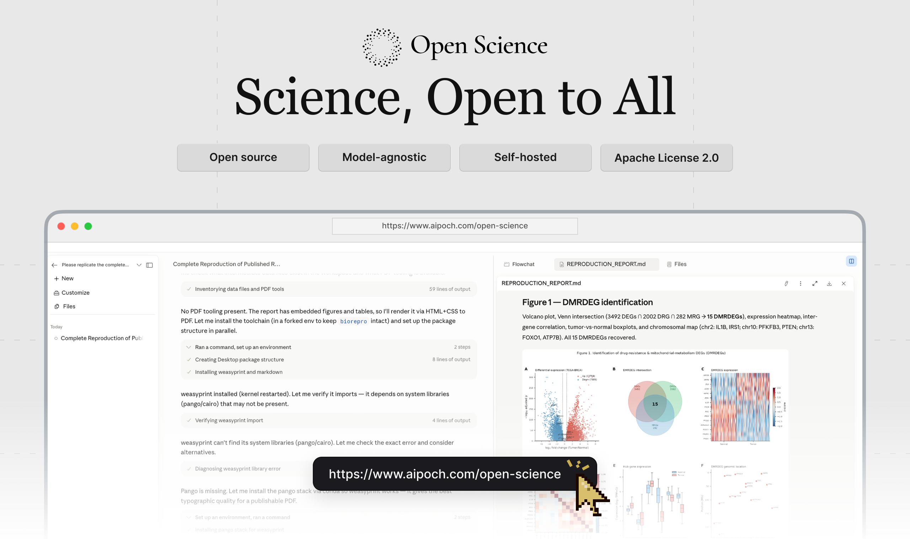
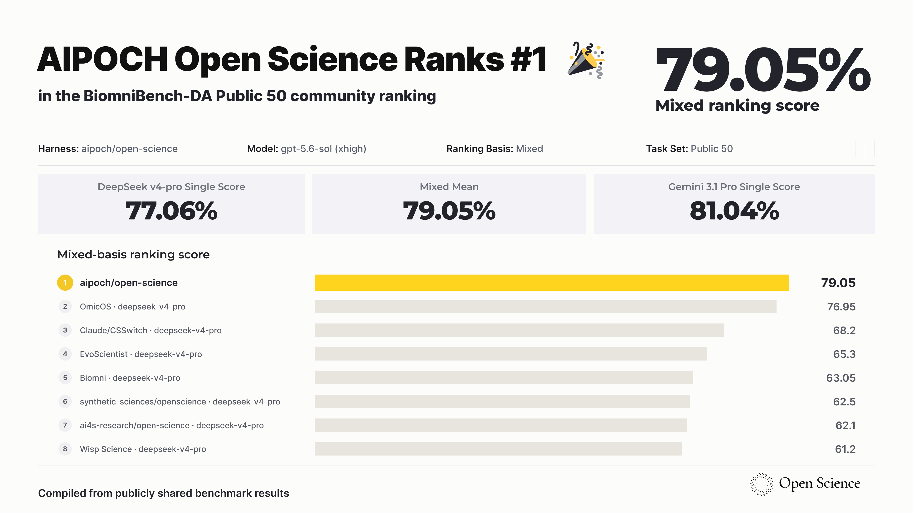

<h1 align="center">AIPOCH Open Science</h1>

<p align="center">
  Open-source, local-first, model-agnostic AI research workbench for reproducible science.
</p>

<p align="center">
  <a href="https://github.com/aipoch/open-science/releases/latest">
    
  </a>
  <a href="https://github.com/aipoch/open-science/releases/latest">
    
  </a>
  <a href="https://doi.org/10.5281/zenodo.22252246">
    
  </a>
  <a href="https://huggingface.co/datasets/phylobio/BiomniBench-DA">
    
  </a>
  <a href="https://github.com/aipoch/open-science/releases/latest">
    
  </a>
  <a href="LICENSE">
    
  </a>
  <a href="https://aipoch.com/open-science">
    
  </a>
  <a href="https://discord.gg/zxQAYjReRv">
    
  </a>
</p>

<p align="center">
  <a href="./README.md"></a>
  <a href="./docs/zh-Hans/README.md"></a>
  <a href="./docs/zh-Hant/README.md"></a>
  <a href="./docs/ja/README.md"></a>
  <a href="./docs/ko/README.md"></a>
  <a href="./docs/fr/README.md"></a>
  <a href="./docs/ru/README.md"></a>
  <a href="./docs/de/README.md"></a>
  <a href="./docs/es/README.md"></a>
</p>

Open Science is an open-source, local-first, model-agnostic AI research workbench developed by [AIPOCH](https://aipoch.com/open-science) for scientists and researchers. It enables reproducible, inspectable research with scientific AI agents, Python and R execution, scientific data connectors, and cross-platform support for macOS, Windows, and Linux. Create a project, describe your research goal in plain language, and let the agents read files, search the web, run code, query scientific data sources, and produce reports, tables, and figures with traceable provenance—all in one workspace.

Open Science supports computational and data-intensive research across disciplines, including machine learning, statistics, life sciences, chemistry, materials science, physics and environmental science. It supports the research process from literature review and hypothesis development to code execution, data analysis, simulation, visualization, and the production of traceable research outputs.

> 💡 **[Open Science v0.26.0 released](https://github.com/aipoch/open-science/releases/latest)** _(last updated September 2026)_. Open Science v0.26.0 brings HPC-class compute and a literature workspace: remote compute hosts gain a per-host Slurm execution mode alongside direct SSH, and a new reference library organizes references, PDFs, and citations with identifier-aware imports, duplicate merging, open-access full-text attachment, and citation formatting. Apodex joins the built-in providers alongside the latest OpenAI and Anthropic models, notebook tool calls become readable summary cards, and smoother streaming, quieter default permissions, and a broad set of fixes land throughout. See the [latest release notes](https://github.com/aipoch/open-science/releases/latest) for full details.

<p align="center">
 
</p>

## Table of Contents

- [Quick Start](#-quick-start)
- [Product Tour](#product-tour)
- [Benchmark Performance](#benchmark-performance)
- [Why Open Science](#why-open-science)
- [Core Capabilities](#core-capabilities)
- [Model Providers](#model-providers)
- [Data, Permissions, and Trust](#data-permissions-and-trust)
- [Project Status](#project-status)
- [Development & Packaging](#development--packaging)
- [Frequently Asked Questions](#frequently-asked-questions)
- [Get Involved](#get-involved)
- [License](#license)
- [Star History](#star-history)

## 🚀 Quick Start

Get Open Science running in three steps: download the installer for your platform, complete the guided first-run setup, and create a research project.

### 1. Download the app

Open the [latest release](https://github.com/aipoch/open-science/releases/latest), expand **Assets**, and choose the installer for your computer:

| Your computer                       | Choose                                   |
| ----------------------------------- | ---------------------------------------- |
| macOS — Apple Silicon (M1 or newer) | The macOS DMG for Apple Silicon / ARM64  |
| macOS — Intel                       | The macOS DMG for Intel / x64            |
| Windows x64                         | The Windows x64 installer                |
| Linux x64                           | The Linux x64 AppImage or Debian package |

Review the assets and verification information published on the release page. See [Verifying your download](SECURITY.md#verifying-your-download) before installation if you need to validate a package.

> If macOS or Windows shows an unidentified-developer or unknown-publisher warning, verify that the package came from the official Releases page before continuing.

On macOS, you can also install with [Homebrew](https://brew.sh):

```bash
brew install --cask open-science
```

Homebrew selects the Apple Silicon or Intel package automatically.

### 2. Complete first-time setup

The first launch has five guided steps:

1. **Environment** checks compatibility, app storage, secure credential storage, and network access.
2. **Data location** chooses where large artifacts, notebooks, uploads, and environments are stored.
3. **Agent runtime** selects and prepares Claude Code, OpenCode, Codex, or CodeBuddy. App-managed runtimes can be installed without requiring Node.js, npm, or an administrator password.
4. **Model provider** connects and tests the model you want to use. Choose a built-in provider, a custom gateway, or an existing Claude or Codex subscription login.
5. **Notebook runtime** optionally prepares app-managed Python and R environments or enables detected and manually registered interpreters for either language.

<table>
  <tr>
    <td width="50%"></td>
    <td width="50%"></td>
  </tr>
  <tr>
    <td align="center"><sub>Host compatibility, storage, and network checks</sub></td>
    <td align="center"><sub>Provider, API Key, endpoint, and model validation</sub></td>
  </tr>
</table>

Notebook execution is optional. Every required environment and agent-runtime check must pass before `Continue` becomes available, and the model connection must pass before setup finishes. Notebook and data-location settings can keep their defaults and be changed later in Settings. While a kernel is running, a Variables view can inspect the live Python or R namespace — names, types, shapes, and previews — read-only, refreshed after each execution.

### 3. Start a research project

1. Click **New project** and give the project a stable research name and optional description.
2. Open a session and describe the goal, input data, constraints, desired outputs, and how the result should be checked.
3. Attach source files, select a verified model, and choose an approval mode.
4. Send the task. Inspect the agent's tool activity, approve sensitive actions, and open generated artifacts in the preview panel.
5. To explore a different direction, edit an earlier user message and resend it on a new branch; use the message revision controls to return to either path.
6. Open an artifact's **Provenance** view to inspect its versions and the available evidence behind the selected result.
7. Continue the work in later sessions. Use `@` to reference an existing project file and `/` to explicitly select an enabled skill.

> Screenshots in this README illustrate the workflow. Labels, catalogs, and other interface details may differ from the version you install.

## Product Tour

Open Science organizes research into projects and sessions so that every result can stay connected to the evidence that produced it. The sections below walk through the workspace, artifact provenance, previews, scientific skills, and data connectors.

### One workspace from task to traceable artifacts

Projects keep related sessions, uploads, generated files, and preview state together. The conversation records the agent's answer and the commands, file reads, edits, searches, and connector calls that produced it. Each generated artifact is stored as an immutable, checksummed version. Its **Provenance** view exposes the evidence Open Science could verify at creation time: producer code and execution history, referenced inputs, an observed environment inventory, the producing conversation branch, and any version-scoped reviewer findings. Missing evidence is shown as unavailable instead of being guessed.

<table>
  <tr>
    <td width="50%"></td>
    <td width="50%"></td>
  </tr>
  <tr>
    <td align="center"><sub>Uploads and generated files organized by project and session</sub></td>
    <td align="center"><sub>Native previews keep data and the research history side by side</sub></td>
  </tr>
</table>

Generated reports, figures, and tables remain attached to the session and are also collected in the project file library. Preview tabs keep the active result visible as the panel changes size, and long names preserve their identifying suffix and extension. Open Science previews common scientific data, PDFs, Office documents (DOCX, XLSX, PPTX), images (with zoom and pan), source code with syntax highlighting, molecular structures and reactions, and Notebook history. Preview limits do not truncate the underlying file—the full artifact stays available to the agent and external tools. Use `Cmd/Ctrl+F` to search transcripts, Notebook output, and rendered pages across the workspace, or `Cmd/Ctrl+K` to open the project-scoped command palette. A dark mode rounds out the workspace: toggle the theme in **Settings → General** and the whole shell, transcript, and renderer palette switch without a flash. The interface is also available in German, Spanish, Chinese (Simplified and Traditional), Japanese, Korean, French, and Russian with a runtime language switcher in Settings.

### Branch a conversation without losing the original

Edit a completed user message to resend a revised prompt from that point. Open Science creates a new message branch instead of deleting the turns that followed, and revision controls let you move between the original and alternative paths. Branch selection, tool activity, attachments, and generated artifacts persist across project switches and restarts. Provenance remains tied to the exact branch that produced each artifact version, so exploring a different hypothesis does not blur the record of the earlier result.

### Scientific skills and data connectors

Open Science includes a growing catalog of **22 featured**, file-based research skills: AlphaFold2, Boltz, Borzoi, Chai-1, Customize, DiffDock, Environment & Packages, ESM-2, ESMFold2, Evo 2, Figure Composer, Figure Style, Indication Dossier, LigandMPNN, Literature Review, OpenFold3, Paper Narrative, ProteinMPNN, scGPT, scvi-tools, SolubleMPNN, and **Remote Compute (SSH)** for submitting and harvesting long-running jobs on remote HPC clusters. You can create personal skills, upload `SKILL.md`/ZIP/`.skill` packages, preview and import compatible skills from GitHub with optional authenticated access, or import skills already installed in your global agent directories. The agent can also request a package import from a session attachment or a public GitHub URL, with an app-owned preview and confirmation step before anything is written. Enabled skills can be selected directly in the composer with `/`.

It also includes **24 built-in** research connectors: Literature Graph, PubMed, bioRxiv, Genes & Ontologies, Genomes, BioMart, Variants, Human Genetics, Clinical Genomics, Structures & Interactions, Protein Annotation, Expression, Omics Archives, CellGuide, Regulation, RNA, Chemistry, ChEMBL, ZINC, Molecule Viewer, Clinical Trials, Drug Regulatory, Cancer Models, and Research Resources. Built-in and custom connectors remain behind the permission system, with per-tool `Always allow`, `Ask each time`, and `Block` controls. The installed app shows the current skill, connector, and tool catalogs.

<table>
  <tr>
    <td width="50%"></td>
    <td width="50%"></td>
  </tr>
  <tr>
    <td align="center"><sub>Readable, reusable research skills</sub></td>
    <td align="center"><sub>Scientific databases exposed as permissioned agent tools</sub></td>
  </tr>
</table>

## Benchmark Performance

### 🏆 #1 on BiomniBench-DA Public 50

Open Science achieved the highest ranking score in the compiled BiomniBench-DA Public 50 comparison, earning **79.05** with **gpt-5.6-sol (xhigh)**. The result combines a Gemini 3.1 Pro judge score of **81.04** and a DeepSeek v4-pro judge score of **77.06** through an equal-weight mean, placing Open Science **#1** among the collected Public 50 results. Explore the [BiomniBench-DA dataset](https://huggingface.co/datasets/phylobio/BiomniBench-DA).

<p align="center">
  
</p>

## Why Open Science

Open Science turns fragmented chats, notebooks, scripts, scientific databases, files, and reporting tools into one persistent, local-first AI research workbench where execution and evidence stay together.

- **Persistent execution.** Projects, sessions, files, previews, and run history survive restarts, while approved agents can run commands, Python, and R and generate artifacts.
- **Traceable results.** Immutable artifact versions preserve verifiable production evidence and clearly mark what is unavailable.
- **Model-agnostic choice.** Connect built-in cloud providers, compatible custom gateways, or Claude and Codex subscriptions, then choose the model and reasoning effort for each session.
- **Local-first control.** Application and project state stay on your computer; external calls use only services you configure or approve.
- **Open and extensible.** The independent Apache-2.0 codebase, skills, connectors, tool activity, and generated files are inspectable, and you can add skills and MCP connectors.

[AIPOCH](https://aipoch.com/) develops [Open Science](https://aipoch.com/open-science) as its open-source, local-first desktop research workbench for scientific AI workflows.

## Core Capabilities

Open Science combines project management, multi-model agent execution, Python and R notebooks, scientific data connectors, immutable artifact versions with provenance, and permissioned human-in-the-loop control in one local workspace. The installed app and [latest release notes](https://github.com/aipoch/open-science/releases/latest) are the source of truth for changing catalogs, packaging details, and newly added options.

| Area                                                   | Core capability                                                                                                                                                                                                                                                                                                                                                                                                                                                                                                                                                                            |
| ------------------------------------------------------ | ------------------------------------------------------------------------------------------------------------------------------------------------------------------------------------------------------------------------------------------------------------------------------------------------------------------------------------------------------------------------------------------------------------------------------------------------------------------------------------------------------------------------------------------------------------------------------------------ |
| **Projects and sessions**                              | Create and organize projects with pinned sessions, persistent message branches and side conversations, and editable session details. Edit completed prompts into persistent, selectable message branches without deleting the original downstream path, and recover recent work, drafts, conversation history, and preview state.                                                                                                                                                                                                                                                          |
| **Agent workflow**                                     | Natural-language sessions with streamed responses, purpose-grouped tool activity, approval and stop controls, queued follow-ups, context compaction, and restart recovery. Branch completed work into new sessions; use structured clarifications, text, image, and PDF annotations, linked-PDF reading context, project memory, session references, and review-gated plans. Notifications, live status, timing and token details, the command palette, source previews, and project switching keep long-running research visible and manageable.                                          |
| **Models and agent backends**                          | Use built-in cloud providers including Apodex, NVIDIA Build with a curated agent-capable catalog, and the latest OpenAI and Anthropic model catalogs (GPT-6 Astra and Claude Fable 5.1), custom compatible gateways, or Claude and Codex subscription logins. Select Claude Code, OpenCode, Codex, or the login-free CodeBuddy runtime as the agent backend, with validated model and API compatibility, multimodal image input, reasoning controls, and dedicated subagent, reviewer, and Vision policies.                                                                                |
| **Specialists and delegation**                         | Create personal specialist agents with scoped capabilities, conversational customization, package import/export, and immediate handoff from the main agent. The signed-package marketplace supports official and user-approved GitHub sources, conflict-aware imports, and 64 built-in capability icons; production delegation adds durable messaging, recovery, and a per-session delegation switch.                                                                                                                                                                                      |
| **Python, R, notebooks, and HPC**                      | Run persistent Python, R, and REPL kernels alongside recorded shell commands, using managed offline environments or your own interpreters. Work locally or connect to remote hosts over SSH and submit Notebook runs through Slurm on HPC clusters; protected network access, encrypted credentials, package and variable inspection, a shared terminal, and progressive history keep compute controlled and observable. Package management for external R runtimes remains manual.                                                                                                        |
| **Literature review and reference management**         | Import references by DOI, PubMed ID, arXiv ID, or file; organize collections, link references to projects, and recover downloaded PDFs from Trash. Search Europe PMC, PMC, OpenAlex, arXiv, and Unpaywall in parallel for open-access full text, merge duplicate records without losing attachments or links, and format citations from stored metadata with artifact provenance.                                                                                                                                                                                                          |
| **Scientific files and previews**                      | Attach files up to 10 GB with streaming upload; organize and search a project library; reference uploads, outputs, and local folders with `@` and `@path`; and export files, conversations, or `.ipynb` sessions. Preview scientific data, searchable PDFs, Office files, TIFF and other images, source code, molecular structures and reactions, and Notebook history inline or full-screen, with provenance and return-to-source navigation.                                                                                                                                             |
| **Artifacts and provenance**                           | Keep immutable, session-scoped artifact versions with checksummed content, producer code, execution history, exact inputs, environment inventory, message-branch context, lineage, and reviewer evidence. Editable Markdown, text, scripts, and source code publish a new provenance-preserving version on every save, with predecessor comparison.                                                                                                                                                                                                                                        |
| **Scientific skills and data connectors**              | Extend research workflows with **22 featured** built-in skills and **24 built-in** research connectors. Create skills conversationally or from completed work, import packages and GitHub sources, and add custom local or remote MCP connectors with tool-level permissions and configuration import/export. Cross-resource tags, a protected Favorites tag, and searchable filters organize skills, connectors, and specialists.                                                                                                                                                         |
| **Local data, privacy, permissions, and verification** | Keep project data, application state, and Notebook caches local in configurable, migratable storage; use system, manual, or direct proxy modes and a token dashboard with a 30-day activity heatmap and per-run attribution. Control actions with `Ask for approval`, `Auto-approve edits`, or `Full access`, scoped grants, centralized credentials, user-approved compute domains, and per-connector and per-tool policies. An opt-in reviewer audits transcripts, execution logs, and artifacts, reports pass/warn/fail findings, and can run a bounded fix loop with durable evidence. |

## Model Providers

Open Science is model-agnostic at the product level: connect it to major cloud LLM providers, a custom gateway, or reuse an existing Claude or Codex subscription. Provider availability currently depends on the selected agent backend and the API protocols it supports. There are four ways to connect a model:

| Provider mode                | How it works                                                                                                                                                                                                                                                                                                                     |
| ---------------------------- | -------------------------------------------------------------------------------------------------------------------------------------------------------------------------------------------------------------------------------------------------------------------------------------------------------------------------------- |
| **Built-in cloud providers** | Choose from the provider list shown by the installed app and authenticate with the requested key.                                                                                                                                                                                                                                |
| **Custom Gateway**           | Supply a compatible Base URL, API Key, and exact model ID. The default API format (Messages, Chat Completions, or Responses) is derived from the active agent framework, so a new custom gateway is compatible out of the box.                                                                                                   |
| **Codex Subscription**       | Select the Codex agent framework, then choose Codex Subscription as the provider type.                                                                                                                                                                                                                                           |
| **Claude Subscription**      | Sign in with a Claude subscription in two modes: **shared** (a browser login that stores credentials in your default `~/.claude` profile) or **isolated** (an app-managed `claude setup-token` run under an app-owned `CLAUDE_CONFIG_DIR`, fully isolated from `~/.claude/`, with a browser flow plus a paste-a-token fallback). |

The legacy **Local Claude** provider has been removed. Previously stored Local Claude entries are
dropped during upgrade; add **Claude Subscription** and authenticate with shared browser login or
the isolated `claude setup-token` flow instead.

Built-in cloud vendors currently include OpenAI, Anthropic, Grok (xAI), DeepSeek, Zhipu AI (GLM) with a dedicated GLM Coding Plan endpoint, Kimi (Moonshot), MiniMax, StepFun with a dedicated Step Plan subscription endpoint, Xiaomi MIMO, SenseNova, Volcengine Ark, Bailian (Alibaba Cloud) with a dedicated Bailian for Plan subscription endpoint, Tencent TokenHub plus dedicated Tencent Coding Plan and Token Plan subscription endpoints, OpenCode Go and OpenCode Zen, and the OpenRouter aggregation gateway, among others; some are region-specific.

Provider vendors, available models, and regional endpoints can evolve independently of this README. Treat the provider picker and connection test in the installed app as the source of truth.

## Data, Permissions, and Trust

Open Science stores project data, settings, artifact versions, and provenance evidence on the local computer. API Keys are kept locally and use the operating system's secure credential storage when it is available. Logs are local and are not uploaded automatically.

External data flow is still possible and should be reviewed:

- Model requests send the prompt and necessary context to the selected model provider.
- Web searches and remote connectors send their displayed parameters to external services.
- Local connectors may execute trusted commands on the computer.
- Attachments, `@` references, logs, and generated reports may contain sensitive research data.

Choose the narrowest permission profile that fits the task:

| Mode                 | Behavior                                                                         | Recommended use                                           |
| -------------------- | -------------------------------------------------------------------------------- | --------------------------------------------------------- |
| `Ask for approval`   | Asks before edits, commands, network, and connector calls                        | New workflows, sensitive data, unfamiliar scripts         |
| `Auto-approve edits` | Automatically allows workspace edits; asks for commands, network, and connectors | Trusted file-editing work with controlled external access |
| `Full access`        | Automatically allows edits, commands, network, and connectors                    | Clearly scoped, fully trusted, unattended work            |

Review connector parameters and tool activity before approving them. Never include API Keys, access tokens, patient identifiers, unpublished data, or sensitive local paths in screenshots or public issue logs.

## Project Status

Open Science is an actively developed desktop application available for macOS, Windows, and Linux. Development focuses on reliable local-first research workflows, extensible scientific capabilities, traceable research artifacts, and user-controlled execution.

See the [latest release](https://github.com/aipoch/open-science/releases/latest) for current downloads and version-specific changes. For shipped, partial, and planned capabilities, see the [Capability Map](ROADMAP.md#capability-map).

Open Science assists research execution and record-keeping; researchers remain responsible for methods, interpretation, privacy, and scientific validity.

## Development & Packaging

Open Science is an Electron application built with React, TypeScript, Prisma/SQLite, and an ACP-based agent runtime.

Prerequisites for source development:

- Node.js 22 (see [`.nvmrc`](.nvmrc)) with npm
- Git
- Python 3 only if you want Notebook execution

```bash
git clone https://github.com/aipoch/open-science.git
cd open-science
npm install
npm run dev
```

`npm install` automatically generates the Prisma client and installs Electron native dependencies. `npm run dev` builds the Electron main/preload bundles, starts the renderer, and opens the desktop app. Development data is isolated under `~/.open-science-project`.

Useful commands:

| Command                | Purpose                                  |
| ---------------------- | ---------------------------------------- |
| `npm run dev`          | Start the development application        |
| `npm run dev:web`      | Dev app + localhost web UI (127.0.0.1)   |
| `npm run dev:headless` | Dev backend + web UI, no Electron window |
| `npm run lint`         | Run ESLint                               |
| `npm run typecheck`    | Type-check main and renderer code        |
| `npm test`             | Run the Vitest suite                     |
| `npm run build`        | Type-check and build the application     |
| `npm run build:web`    | Build the optional localhost web UI      |
| `npm run build:mac`    | Package macOS builds                     |
| `npm run build:win`    | Package Windows builds                   |
| `npm run build:linux`  | Package Linux builds                     |

Packaged output is written under `dist/`.

### Localhost web and headless modes

The desktop backend can optionally serve the same renderer to a browser on the local computer. This
feature is off by default and binds only to `127.0.0.1`.

```bash
npm run build:web
npm run dev:web
```

Open the authenticated URL printed by the application. Use `npm run dev:headless` to start the
backend, tray, agent runtime, and localhost web service without opening an Electron window.
Set `OPEN_SCIENCE_WEB_PORT` to choose a port (default `44100`). Explicitly quitting the
application still shuts down agent and Notebook processes normally.

### Mobile remote access

The same localhost web UI can be reached from a phone or tablet through Remote.It pairing. Pair
a browser with a six-digit Open Science code, approve it once on the desktop, and the workspace
stays reachable without exposing the loopback server directly. Browser trust is revocable, and
mode changes or service shutdown immediately invalidate active remote sessions.

### Headless CLI and SDK

The headless CLI and zero-dependency Node.js SDK use the same local daemon, projects, sessions,
credentials, and permissions as the desktop and web interfaces. Detailed usage lives with the
publishable package so there is one command reference to maintain:

- [CLI guide](packages/open-science/CLI.md) - installation, service lifecycle, task automation,
  artifacts, output formats, and exit codes
- [SDK package overview](packages/open-science/README.md) - Node.js quick start and package entry point

## Frequently Asked Questions

### What should I do the first time I open Open Science?

A: Complete the five setup steps: **Environment**, **Data location**, **Agent runtime**, **Model provider**, and **Notebook runtime**. Fix required rows marked `Action needed`, install or repair the selected agent if offered, and test the model connection. Notebook setup and a custom data location are optional.

### What is an API Key, and where do I get one?

A: An API Key is a secret credential issued by a model provider. Create or copy one from that provider's developer/API console. The provider may bill requests made with the key. Treat it like a password: never share it or commit it to a repository.

### Do I need an API Key?

A: Not if you reuse an existing subscription login — a Claude subscription through shared browser login or an isolated app-managed `claude setup-token` flow, or a ChatGPT/Codex subscription login on the Codex backend. Built-in cloud providers and custom gateways require their own keys.

### Which model providers can I use?

A: Open the provider picker during setup or under `Settings → Model` for the choices supported by your installed app and selected agent backend. You can use a built-in cloud provider, a compatible Custom Gateway, a Claude subscription through shared or isolated login, or a Codex subscription on the Codex backend.

### Why does the model connection test fail?

A: Check the API Key for missing characters or spaces, verify the Base URL and region, use the provider's exact model ID, and confirm network access and account balance. For a Claude subscription, retry the shared browser login or refresh the isolated `claude setup-token` credential, depending on the selected mode.

### Why is `Continue` disabled during setup?

A: The current step has not met its required condition. Fix any environment row marked `Action needed`, install or repair the selected agent runtime, or validate the model provider, depending on the active step. Notebook setup is optional and only affects Notebook execution.

### Setup is complete. How do I start a research task?

A: Create or open a project, start a session, attach any source files, and describe the goal, constraints, expected output, and validation criteria. Use `@` to reference a project file and `/` to select an enabled skill.

### How do I run jobs on a remote HPC cluster?

A: Enable the **Remote Compute (SSH)** skill under **Settings → Skills**, register your cluster under **Settings → Compute**, then start a session and select the skill with `/remote-compute-ssh`. The skill handles host registration, short commands via SSH, and fully async job submission — the app automatically starts an analysis turn when the job finishes, so you never write a polling loop.

### Is there a command-line interface?

A: Yes. Install it in one click from **Settings → General → Command line tool → Install command** (adds `open-science` to your PATH; no separate Node.js needed). The CLI controls the local service and submits research tasks without opening a browser:

```bash
# Start the service in the background
open-science start --no-open

# Create a project and run a task by its exact name
open-science project create "Systematic review"
open-science run --project "Systematic review" \
  --prompt-file ./task.md \
  --approval-profile auto \
  --skill literature-review \
  --wait --json

# Download a generated artifact
open-science artifacts list <session-id> --json
open-science artifacts download <artifact-id> --output ./report.md
```

See the [CLI guide](packages/open-science/CLI.md) for the full command reference, JSON/JSONL output formats, exit codes, and headless service options.

### How do I inspect where a generated result came from?

A: Open the generated artifact and choose **Provenance**. Select a version to inspect the content identity and the available producer code, execution history, inputs, environment inventory, producing conversation context, and reviewer evidence. Evidence Open Science could not verify is marked unavailable.

### Can I revise an earlier request without losing the conversation that followed?

A: Yes. Edit a completed user message and resend it to create a new branch from that point. The original later turns remain available, and the revision arrows beside the message switch between the alternative paths.

### Does my research data stay on my computer?

A: Projects, sessions, files, settings, and configured credentials are stored locally by default. Content needed for model requests, web searches, or connector calls may still be sent to the external service you selected, so review sensitive inputs and provider policies before running a task.

## Get Involved

Open Science welcomes bug reports, feature proposals, design discussions, community questions, and contributions through GitHub, Discord, X, and the AIPOCH website. Choose the channel that best matches your goal, then follow the linked contribution guidance and public-posting safety reminder before sharing project details.

| Channel                                                                  | Use it for                                                              |
| ------------------------------------------------------------------------ | ----------------------------------------------------------------------- |
| [GitHub Issues](https://github.com/aipoch/open-science/issues)           | Bugs, reproducible failures, and concrete feature proposals             |
| [GitHub Discussions](https://github.com/aipoch/open-science/discussions) | Design questions, roadmap proposals, and longer technical conversations |
| [Discord](https://discord.gg/zxQAYjReRv)                                 | Community help, contributor coordination, and informal discussion       |
| [X / @aipoch_ai](https://x.com/aipoch_ai)                                | Release announcements and build-in-public updates                       |
| [Open Science website](https://aipoch.com/open-science)                  | Official product overview and downloads                                 |

Before opening a public issue, remove API Keys, tokens, private file paths, unpublished data, patient identifiers, and other sensitive material from logs and screenshots. See [CONTRIBUTING.md](CONTRIBUTING.md) for the development workflow.

> ⭐ **Star the repo:** If this project has been helpful, we'd greatly appreciate a star on GitHub. Starring the repository encourages continued development. It only takes a second, but it has a meaningful impact on the project.

## License

Apache License 2.0 — see [LICENSE](LICENSE).

## Star History

<a href="https://star-history.dera.page/#aipoch/open-science&type=date&legend=top-left">
 <picture>
   <source media="(prefers-color-scheme: dark)" srcset="https://star-history.dera.page/svg?repos=aipoch/open-science&type=date&theme=dark&legend=top-left" />
   <source media="(prefers-color-scheme: light)" srcset="https://star-history.dera.page/svg?repos=aipoch/open-science&type=date&legend=top-left" />
   
 </picture>
</a>
