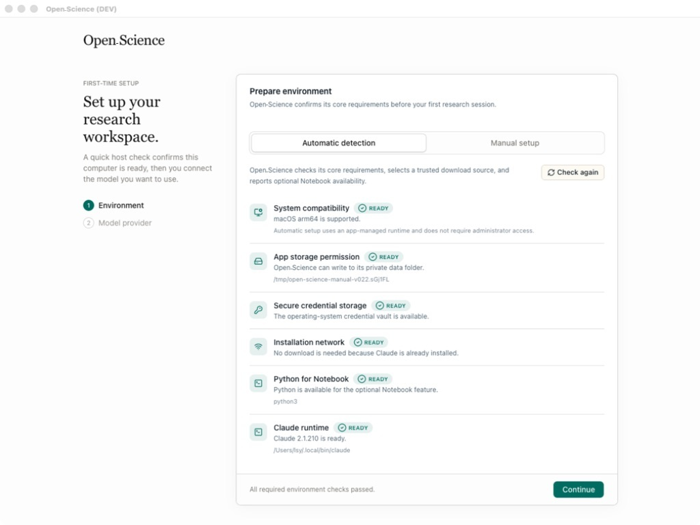
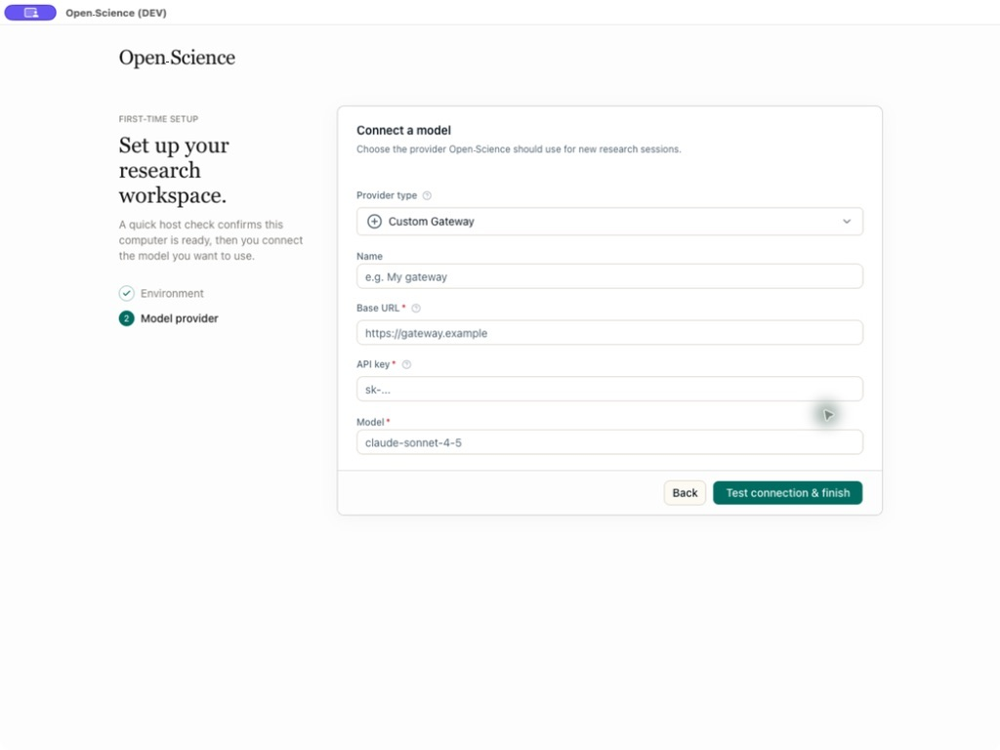
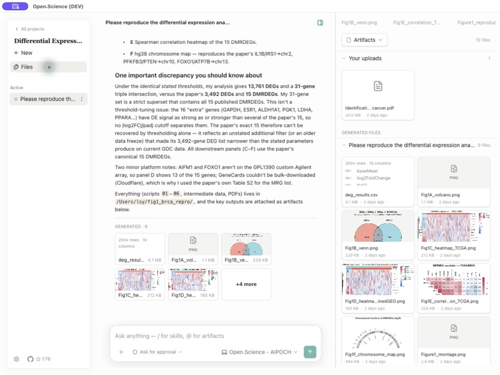
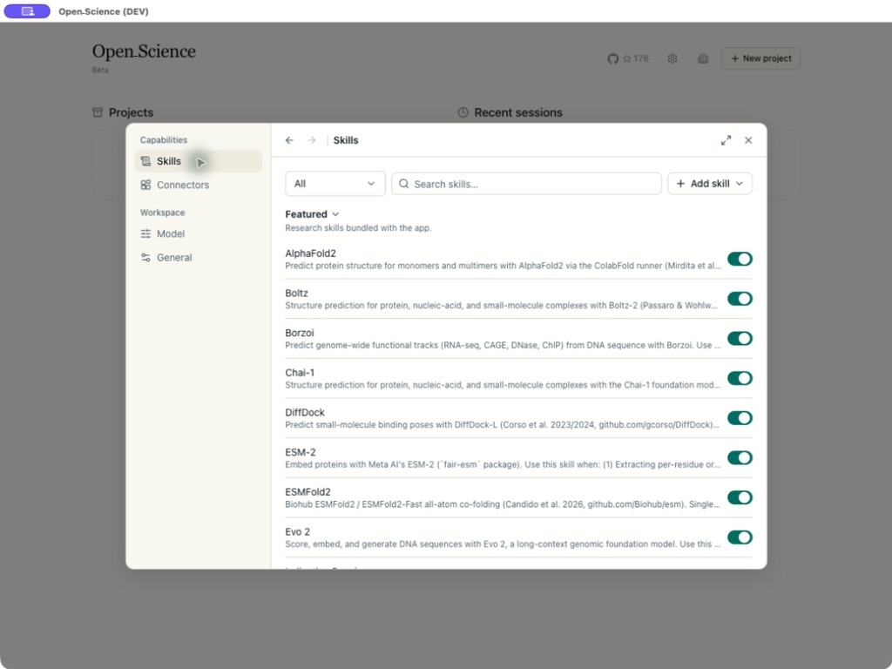

# Open Science – Die quelloffene KI-Forschungsumgebung mit wissenschaftlichen KI-Agenten

[](https://github.com/aipoch/open-science/releases/latest)
[](https://github.com/aipoch/open-science/releases/latest)
[](../../LICENSE)
[](https://aipoch.com/open-science)
[](https://discord.gg/zxQAYjReRv)

<p align="center">
  <a href="../../README.md"></a>
  <a href="../zh-Hans/README.md"></a>
  <a href="../zh-Hant/README.md"></a>
  <a href="../ja/README.md"></a>
  <a href="../ko/README.md"></a>
  <a href="../fr/README.md"></a>
  <a href="../ru/README.md"></a>
  <a href="../de/README.md"></a>
  <a href="../es/README.md"></a>
</p>

> Dieses Dokument ist eine Übersetzung der englischen `README.md`. Bei Abweichungen ist die [englische Version](../../README.md) maßgeblich.

Open Science ist eine von [AIPOCH](https://aipoch.com/open-science) entwickelte, quelloffene, lokal betriebene und modellunabhängige KI-Forschungsumgebung für Wissenschaftler und Forschende. Sie ermöglicht reproduzierbare und nachvollziehbare Forschung mit wissenschaftlichen KI-Agenten, Python und R, wissenschaftlichen Datenkonnektoren sowie Unterstützung für macOS, Windows und Linux. Erstellen Sie ein Projekt, beschreiben Sie Ihr Forschungsziel in natürlicher Sprache und lassen Sie Agenten Dateien lesen, im Web recherchieren, Code ausführen, wissenschaftliche Datenquellen abfragen und Berichte, Tabellen oder Abbildungen mit nachvollziehbarer Provenienz erstellen – alles in einem Arbeitsbereich.

Open Science unterstützt rechen- und datenintensive Forschung in zahlreichen Disziplinen, darunter maschinelles Lernen, Statistik, Biowissenschaften, Chemie, Materialwissenschaften, Physik und Umweltwissenschaften. Die Umgebung begleitet den Forschungsprozess von der Literaturrecherche und Hypothesenbildung über Codeausführung, Datenanalyse, Simulation und Visualisierung bis zur Erstellung nachvollziehbarer Forschungsergebnisse.

> 💡 **[Open Science v0.24.0 veröffentlicht](https://github.com/aipoch/open-science/releases/latest)** _(zuletzt aktualisiert im August 2026)_. Open Science v0.24.0 macht den Wechsel zwischen Projekten schneller und das Ausführen von Code sicherer: ein Projekt-Schnellwechsler im Arbeitsbereich-Menü, Netzwerkzugriff aus Notebook- und Compute-Laufzeiten beschränkt auf die von Ihnen freigegebenen Domains mit Freigabe im Gespräch für neue Ziele (unter Windows, sobald die einmalige Admin-Einrichtung der Sandbox abgeschlossen ist), geräteweit geteilte Anmeldeinformationen, an die sich benutzerdefinierte Konnektoren binden können, sichere Standardberechtigungen mit Ein-Klick-Wiederherstellung sowie eine deutsche Benutzeroberfläche – dazu unveränderliche Dateigenerationen für Notebook- und Compute-Läufe, gehärtete Remote-Compute-Jobs und eine breite Palette an Korrekturen für Runtime, Konnektoren und Speicherung. Einzelheiten finden Sie in den [neuesten Versionshinweisen](https://github.com/aipoch/open-science/releases/latest).

<p align="center">
 
</p>

## Inhaltsverzeichnis

- [Schnellstart](#-schnellstart)
- [Produkttour](#produkttour)
- [Warum Open Science](#warum-open-science)
- [Designprinzipien](#designprinzipien)
- [Kernkompetenzen](#kernkompetenzen)
- [Modellanbieter](#modellanbieter)
- [Daten, Berechtigungen und Vertrauen](#daten-berechtigungen-und-vertrauen)
- [Projektstatus](#projektstatus)
- [Entwicklung & Verpackung](#entwicklung--verpackung)
- [Roadmap](#roadmap)
- [Beziehung zum AIPOCH-Ökosystem](#beziehung-zum-aipoch-ökosystem)
- [Was das nicht ist](#was-das-nicht-ist)
- [Häufig gestellte Fragen](#häufig-gestellte-fragen)
- [Machen Sie mit](#machen-sie-mit)
- [Lizenz](#lizenz)
- [Sterngeschichte](#sterngeschichte)

## 🚀 Schnellstart

Open Science ist in drei Schritten einsatzbereit: Installationspaket herunterladen, geführte Ersteinrichtung abschließen und ein Forschungsprojekt erstellen.

### 1. Laden Sie die App herunter

Öffnen Sie die [neueste Version](https://github.com/aipoch/open-science/releases/latest), klappen Sie **Assets** auf und wählen Sie das passende Installationspaket aus:

| Ihr Computer                          | Wählen Sie                                |
| ------------------------------------- | ----------------------------------------- |
| macOS – Apple Silicon (M1 oder neuer) | Das macOS DMG für Apple Silicon / ARM64   |
| macOS – Intel                         | Das macOS DMG für Intel / x64             |
| Windows x64                           | Das Windows x64-Installationsprogramm     |
| Linux x64                             | Das Linux x64 AppImage- oder Debian-Paket |

Überprüfen Sie die auf der Release-Seite veröffentlichten Assets und Verifizierungsinformationen. Lesen Sie vor der Installation den Abschnitt [Überprüfen Ihres Downloads](../../SECURITY.md#verifying-your-download), wenn Sie ein Paket validieren müssen.

> Wenn macOS oder Windows vor einem nicht identifizierten Entwickler oder einem unbekannten Herausgeber warnt, vergewissern Sie sich vor dem Fortfahren, dass das Paket von der offiziellen Releases-Seite stammt.

### 2. Schließen Sie die Ersteinrichtung ab

Der erste Start besteht aus fünf geführten Schritten:

1. **Umgebung** prüft Kompatibilität, App-Speicher, sichere Speicherung von Anmeldeinformationen und Netzwerkzugriff.
2. **Datenspeicherort** wählt aus, wo große Artefakte, Notebooks, Uploads und Umgebungen gespeichert werden.
3. **Agent-Runtime** wählt Claude Code, OpenCode, Codex oder CodeBuddy aus und bereitet das Framework vor. Von der App verwaltete Runtimes lassen sich ohne Node.js, npm oder Administratorkennwort installieren.
4. **Modellanbieter** verbindet und testet das Modell, das Sie verwenden möchten. Wählen Sie einen integrierten Anbieter, ein benutzerdefiniertes Gateway oder ein vorhandenes Claude- oder Codex-Abonnement-Login.
5. **Notebook-Runtime** bereitet optional von der App verwaltete Python- und R-Umgebungen vor oder aktiviert erkannte und manuell registrierte Interpreter für beide Sprachen.

<table>
<tr>
<td width="50%"></td>
<td width="50%"></td>
</tr>
<tr>
<td align="center"><sub>Hostkompatibilitäts-, Speicher- und Netzwerkprüfungen</sub></td>
<td align="center"><sub>Anbieter, API-Schlüssel, Endpunkt und Modellvalidierung</sub></td>
</tr>
</table>

Die Notebook-Ausführung ist optional. `Continue` wird erst verfügbar, wenn alle erforderlichen Prüfungen für Umgebung und Agent-Runtime erfolgreich waren. Vor Abschluss der Einrichtung muss außerdem die Modellverbindung funktionieren. Die Standardeinstellungen für Notebook und Datenspeicherort können Sie zunächst übernehmen und später in den Einstellungen ändern. Während ein Kernel läuft, zeigt die Ansicht „Variablen“ den Python- oder R-Namensraum mit Namen, Typen, Formen und Vorschauen schreibgeschützt an und aktualisiert ihn nach jeder Ausführung.

### 3. Starten Sie ein Forschungsprojekt

1. Klicken Sie auf **Neues Projekt** und geben Sie dem Projekt einen stabilen Forschungsnamen und optional eine Beschreibung.
2. Öffnen Sie eine Sitzung und beschreiben Sie das Ziel, die Eingabedaten, die Einschränkungen, die gewünschten Ergebnisse und wie das Ergebnis überprüft werden soll.
3. Hängen Sie Quelldateien an, wählen Sie ein verifiziertes Modell und ein Freigabeprofil aus.
4. Senden Sie die Aufgabe. Prüfen Sie die Tool-Aktivität des Agenten, geben Sie vertrauliche Aktionen frei und öffnen Sie generierte Artefakte im Vorschaufenster.
5. Um eine andere Richtung zu verfolgen, bearbeiten Sie eine frühere Benutzernachricht und senden Sie sie in einem neuen Branch erneut. Mit der Versionssteuerung der Nachricht können Sie zwischen beiden Pfaden wechseln.
6. Öffnen Sie die **Provenienzansicht** eines Artefakts, um seine Versionen und die verfügbaren Beweise hinter dem ausgewählten Ergebnis zu überprüfen.
7. Setzen Sie die Arbeit in späteren Sitzungen fort. Verwenden Sie `@`, um auf eine vorhandene Projektdatei zu verweisen, und `/`, um explizit eine aktivierte Fähigkeit auszuwählen.

> Screenshots in dieser README-Datei veranschaulichen den Arbeitsablauf. Beschriftungen, Kataloge und andere Schnittstellendetails können von der von Ihnen installierten Version abweichen.

## Produkttour

Open Science organisiert Forschung in Projekten und Sitzungen, sodass jedes Ergebnis mit den Belegen verknüpft bleibt, aus denen es entstanden ist. Die folgenden Abschnitte stellen Arbeitsbereich, Artefaktprovenienz, Vorschauen, wissenschaftliche Fähigkeiten und Datenkonnektoren vor.

### Ein Arbeitsbereich von der Aufgabe bis zu nachverfolgbaren Artefakten

Projekte bündeln zusammengehörige Sitzungen, Uploads, generierte Dateien und den jeweiligen Vorschaustatus. Die Konversation protokolliert die Antwort des Agenten sowie die Befehle, Dateizugriffe, Bearbeitungen, Suchvorgänge und Konnektoraufrufe, aus denen sie hervorgegangen ist. Jedes generierte Artefakt wird als unveränderliche Version mit Prüfsumme gespeichert. Die Ansicht **Provenienz** zeigt die bei der Erstellung überprüfbaren Belege: erzeugenden Code und Ausführungsverlauf, referenzierte Eingaben, den erfassten Umgebungsbestand, den erzeugenden Konversations-Branch und versionsbezogene Reviewer-Befunde. Fehlende Belege werden als nicht verfügbar gekennzeichnet, statt ergänzt oder vermutet zu werden.

<table>
<tr>
<td width="50%"></td>
<td width="50%"></td>
</tr>
<tr>
<td align="center"><sub>Uploads und generierte Dateien, organisiert nach Projekt und Sitzung</sub></td>
<td align="center"><sub>Native Vorschauen halten Daten und den Forschungsverlauf nebeneinander</sub></td>
</tr>
</table>

Erstellte Berichte, Abbildungen und Tabellen bleiben mit der Sitzung verknüpft und werden zusätzlich in der Projektdateibibliothek gesammelt. Vorschau-Tabs halten das aktive Ergebnis auch bei Größenänderungen des Bereichs sichtbar; lange Dateinamen behalten ihr unterscheidbares Suffix und ihre Erweiterung. Open Science unterstützt Vorschauen für gängige wissenschaftliche Daten, PDFs, Office-Dokumente (DOCX, XLSX, PPTX), Bilder mit Zoom und Verschieben, Quellcode mit Syntaxhervorhebung, molekulare Strukturen und Reaktionen sowie den Notebook-Verlauf. Größenbeschränkungen der Vorschau verändern die zugrunde liegende Datei nicht; das vollständige Artefakt bleibt für den Agenten und externe Tools verfügbar. Mit `Cmd/Ctrl+F` durchsuchen Sie Transkripte, Notebook-Ausgaben und gerenderte Seiten im gesamten Arbeitsbereich. `Cmd/Ctrl+K` öffnet die projektbezogene Befehlspalette. Das Design lässt sich unter **Einstellungen → Allgemein** ohne sichtbares Flackern zwischen hell und dunkel umschalten. Dort können Sie auch zur Laufzeit zwischen Chinesisch (vereinfacht und traditionell), Japanisch, Koreanisch, Französisch, Russisch, Deutsch und Spanisch wechseln.

### Konversation verzweigen, ohne das Original zu verlieren

Bearbeiten Sie eine abgeschlossene Benutzernachricht, um ab diesem Punkt einen überarbeiteten Prompt zu senden. Open Science erstellt einen neuen Nachrichten-Branch, ohne die nachfolgenden Interaktionen zu löschen. Mit der Versionssteuerung wechseln Sie zwischen ursprünglichem und alternativem Pfad. Branch-Auswahl, Tool-Aktivität, Anhänge und generierte Artefakte bleiben bei Projektwechseln und Neustarts erhalten. Die Provenienz jeder Artefaktversion bleibt an den erzeugenden Branch gebunden. So können Sie eine andere Hypothese verfolgen, ohne die Dokumentation des früheren Ergebnisses zu vermischen.

### Wissenschaftliche Fähigkeiten und Datenkonnektoren

Open Science umfasst einen wachsenden Katalog mit **18 ausgewählten**, dateibasierten Forschungsfähigkeiten: AlphaFold2, Boltz, Borzoi, Chai-1, DiffDock, Environment & Packages, ESM-2, ESMFold2, Evo 2, Indication Dossier, LigandMPNN, Literature Review, OpenFold3, ProteinMPNN, scGPT, scvi-tools, SolubleMPNN und **Remote Compute (SSH)** zum Übermitteln und Abrufen lang laufender Jobs auf Remote-HPC-Clustern. Sie können persönliche Fähigkeiten erstellen, `SKILL.md`-, ZIP- oder `.skill`-Pakete hochladen, kompatible Fähigkeiten von GitHub vorab prüfen und optional mit authentifiziertem Zugriff importieren. Auch bereits in globalen Agentenverzeichnissen installierte Fähigkeiten lassen sich übernehmen. Ein Agent kann zudem den Import eines Pakets aus einem Sitzungsanhang oder einer öffentlichen GitHub-URL anfordern. Bevor Dateien geschrieben werden, zeigt die App eine Vorschau und fordert eine Bestätigung an. Aktivierte Fähigkeiten wählen Sie im Composer direkt mit `/` aus.

Hinzu kommen **24 integrierte** Forschungskonnektoren: Literature Graph, PubMed, bioRxiv, Genes & Ontologies, Genomes, BioMart, Variants, Human Genetics, Clinical Genomics, Structures & Interactions, Protein Annotation, Expression, Omics Archives, CellGuide, Regulation, RNA, Chemistry, ChEMBL, ZINC, Molecule Viewer, Clinical Trials, Drug Regulatory, Cancer Models und Research Resources. Für integrierte wie benutzerdefinierte Konnektoren gilt das Berechtigungssystem mit den Tool-spezifischen Optionen `Always allow`, `Ask each time` und `Block`. Die installierte App zeigt jeweils die aktuellen Kataloge für Fähigkeiten, Konnektoren und Tools.

<table>
<tr>
<td width="50%"></td>
<td width="50%"></td>
</tr>
<tr>
<td align="center"><sub>Lesbare, wiederverwendbare Recherchefähigkeiten</sub></td>
<td align="center"><sub>Wissenschaftliche Datenbanken, die als autorisierte Agent-Tools bereitgestellt werden</sub></td>
</tr>
</table>

## Warum Open Science

Open Science vereint Forschungsaufgaben, Ausführung, Dateien und Belege in einem lokalen, transparenten Desktop-Arbeitsbereich.

Forschungsarbeit verteilt sich häufig auf Chatfenster, Notebooks, lokale Skripte, wissenschaftliche Datenbanken, Dateibrowser und Berichtstools. Bei jedem Wechsel kann Kontext verloren gehen; Antworten sind dann oft vom Code und von den Dateien getrennt, aus denen sie entstanden sind.

Open Science vereint diese Teile in einem überprüfbaren Desktop-Arbeitsbereich:

- **Dauerhaft gespeicherte Arbeit.** Projekte, Sitzungen, Entwürfe, Dateien, Vorschauen und Ausführungsverläufe bleiben über App-Neustarts hinweg erhalten.
- **Ausführung statt bloßer Vorschläge.** Mit Ihrer Freigabe kann der Agent Befehle sowie Python- und R-Code ausführen, Dateien bearbeiten, suchen, Konnektoren aufrufen und Artefakte erzeugen.
- **Alternative Pfade ohne Arbeitsverlust.** Überarbeiten Sie einen früheren Prompt in einem neuen Nachrichten-Branch und wechseln Sie zwischen den daraus entstandenen Forschungsrichtungen.
- **Nachvollziehbare Ergebnisse.** Unveränderliche Artefaktversionen bewahren die von Open Science überprüfbaren Entstehungsnachweise auf und kennzeichnen fehlende Belege ausdrücklich.
- **Freie Modellwahl.** Verwenden Sie einen integrierten Cloud-Anbieter, ein kompatibles benutzerdefiniertes Gateway oder ein Claude- beziehungsweise Codex-Abonnement. Modell und Reasoning-Aufwand wählen Sie für jede Sitzung gemeinsam im Composer aus.
- **Lokale Datenhoheit.** App und Projektstatus laufen auf Ihrem Computer. Externe Aufrufe erfolgen nur über Dienste, die Sie ausdrücklich konfigurieren oder freigeben.
- **Transparenz.** Quellcode, Fähigkeiten, Konnektordefinitionen, Tool-Aktivität, generierte Dateien und Artefaktprovenienz sind einsehbar.
- **Erweiterbarkeit.** Fügen Sie Fähigkeiten und MCP-Konnektoren hinzu, anstatt auf eine geschlossene Plugin-Roadmap zu warten.
- **Keine Lizenz pro Benutzer.** Open Science steht unter Apache 2.0. Kosten entstehen nur für die Modelle oder Infrastruktur, die Sie selbst auswählen.

Open Science ist ein unabhängiges Produkt, das von Grund auf neu entwickelt wurde. Es handelt sich nicht um einen Proxy, einen inoffiziellen Client oder eine Neugestaltung einer anderen KI-Forschungsanwendung.

## Designprinzipien

Sieben Designprinzipien bestimmen das Zusammenspiel von Code, Daten, Modellen und menschlicher Kontrolle: Offenheit als Standard, ausdrücklich geprüfte Kompatibilität mit mehreren Anbietern, lokale Datenhoheit, Human-in-the-Loop-Kontrolle, dauerhafte Forschungsaufzeichnungen, kombinierbare Funktionen und transparente wissenschaftliche Grenzen.

- **Standardmäßig offen.** Quellcode, Formate, Konnektoren und Fähigkeiten sollen einsehbar bleiben und sich forken lassen.
- **Mehrere Anbieter mit expliziter Kompatibilität.** Die App validiert die Anbieterkonfiguration und macht Endpunktanforderungen sichtbar, anstatt jedes API-Protokoll als austauschbar zu behandeln.
- **Local First und datenbewusst.** Projektstatus bleibt lokal, externe Datenflüsse werden sichtbar gemacht und autonome Ausführung muss ausdrücklich aktiviert werden.
- **Human-in-the-Loop.** Dateibearbeitungen, Befehle, Netzwerkzugriff und Konnektoraufrufe werden durch ausdrückliche Freigabeprofile geregelt.
- **Dauerhafte Forschungsaufzeichnungen.** Sitzungen, Tool-Aktivität, Notebook-Verlauf und unveränderliche Artefaktversionen bleiben auch nach Abschluss einer Ausführung nachvollziehbar; nicht verfügbare Belege werden klar gekennzeichnet.
- **Kombinierbare Funktionen.** Fähigkeiten, Konnektoren, Modelle, Vorschauen und künftige Compute-Backends sollen austauschbare Bausteine statt einer Blackbox sein.
- **Ehrliche wissenschaftliche Grenzen.** Die generierten Ergebnisse ersetzen kein Expertenurteil, keine statistische Überprüfung oder Validierung anhand primärer Beweise.

## Kernkompetenzen

Open Science verbindet Projektverwaltung, modellübergreifende Agentenausführung, Python- und R-Notebooks, wissenschaftliche Datenkonnektoren, unveränderliche Artefaktversionen mit Provenienz und berechtigungsbasierte Human-in-the-Loop-Kontrolle in einem lokalen Arbeitsbereich. Maßgeblich für veränderliche Kataloge, Paketdetails und neue Optionen sind die installierte App und die [neuesten Versionshinweise](https://github.com/aipoch/open-science/releases/latest).

| Bereich                      | Kernfunktionen                                                                                                                                                                                                                                                                                                                                                                                                                                                                                                                                                                                                                                                                                                                                                                                                                                                                                                                                                                                                                                                                                                                                                                                                                                                                                                                                                                                                                                                                                                                                                                                                                                                                                                                                                                                                                                                                                                                                                                                                                                                                                                                                                                                                                                                                                                                                                                                                                                                                                                                                                                                                                                                                                                                                                                                                                                                                                                                                                                                                                                                              |
| ---------------------------- | --------------------------------------------------------------------------------------------------------------------------------------------------------------------------------------------------------------------------------------------------------------------------------------------------------------------------------------------------------------------------------------------------------------------------------------------------------------------------------------------------------------------------------------------------------------------------------------------------------------------------------------------------------------------------------------------------------------------------------------------------------------------------------------------------------------------------------------------------------------------------------------------------------------------------------------------------------------------------------------------------------------------------------------------------------------------------------------------------------------------------------------------------------------------------------------------------------------------------------------------------------------------------------------------------------------------------------------------------------------------------------------------------------------------------------------------------------------------------------------------------------------------------------------------------------------------------------------------------------------------------------------------------------------------------------------------------------------------------------------------------------------------------------------------------------------------------------------------------------------------------------------------------------------------------------------------------------------------------------------------------------------------------------------------------------------------------------------------------------------------------------------------------------------------------------------------------------------------------------------------------------------------------------------------------------------------------------------------------------------------------------------------------------------------------------------------------------------------------------------------------------------------------------------------------------------------------------------------------------------------------------------------------------------------------------------------------------------------------------------------------------------------------------------------------------------------------------------------------------------------------------------------------------------------------------------------------------------------------------------------------------------------------------------------------------------------------- |
| **Projekte und Sitzungen**   | Projekte erstellen, umbenennen und löschen; mehrere angeheftete Sitzungen verwalten; abgeschlossene Prompts als dauerhafte, auswählbare Nachrichten-Branches bearbeiten, ohne den ursprünglichen Verlauf zu löschen; Side-Chats innerhalb einer Sitzung führen; automatisch erzeugte und bearbeitbare Sitzungsdetails (Titel und Beschreibung); zuletzt bearbeitete Inhalte, Entwürfe, Konversationsverlauf und Vorschaustatus wiederherstellen.                                                                                                                                                                                                                                                                                                                                                                                                                                                                                                                                                                                                                                                                                                                                                                                                                                                                                                                                                                                                                                                                                                                                                                                                                                                                                                                                                                                                                                                                                                                                                                                                                                                                                                                                                                                                                                                                                                                                                                                                                                                                                                                                                                                                                                                                                                                                                                                                                                                                                                                                                                                                                            |
| **Agenten-Workflow**         | Aufgaben in natürlicher Sprache, gestreamte Antworten und typisierte Tool-Aktivitätskarten unter erklärenden Zwecküberschriften; Live-Anzeige der Kontextnutzung mit Schätzungen pro Kategorie und bedarfsgerechte Kontextkomprimierung; dauerhafte Sitzungen über Neustarts hinweg, Steuerelemente zum Stoppen, Freigabepausen und eine Bestätigung mit gespeicherter Einstellung vor dem Schließen oder Beenden während einer laufenden Aufgabe; Nachrichtenwarteschlange im Composer für Folgenachrichten während einer laufenden Interaktion; gemeinsamer Verlauf zum Rückgängigmachen und Wiederholen von Entwurfsänderungen; Verzweigen neuer Sitzungen aus abgeschlossenen Agentennachrichten; Desktop-Benachrichtigungen mit Aufmerksamkeitsgründen, dauerhafte Badges für ungelesene Konversationen und native Aufmerksamkeit bei blockierenden Freigaben; oberflächenübergreifendes Benachrichtigungscenter mit nach Art und Status codierten Symbolen, dauerhaftem Lesestatus und erhaltenen Zielen gelöschter Elemente; strukturierte Rückfragekarten für mehrteilige Agentenanfragen mit Prüfung der Antworten für jede Frage; Text-, Bild- und PDF-Anmerkungen – ausgewählte Texte oder Bereiche lassen sich per Klick im Quelldokument anzeigen – die markierte Inhalte an die Konversation übergeben; Markierungen für Änderungen der Agentenkonfiguration zwischen Interaktionen; erweiterte Zeilen zum Laden von Fähigkeiten, die das geladene Fähigkeitsdokument anzeigen; ein Lesekontext pro Sitzung, in dem bis zu drei PDFs verknüpft werden, damit der Agent die aktuelle Seite und das gesamte Dokument lesen sowie alle PDFs durchsuchen kann; persistente Agentenerinnerungen, die projektbezogenes Wissen sitzungsübergreifend abrufen; abgeschirmte Quellenvorschauen für Links in Agentenantworten direkt in der App; Live-Sitzungsstatus im Start-Dashboard; Zeitmetadaten für Nachrichten mit Popovers für verstrichene Zeit und Nutzung; Token-Nutzung pro Interaktion mit Nutzungsdetails pro Modellaufruf und einem Kontextfensterdiagramm für jeden Aufruf; Anzeige von Agenten-Framework und Modell für abgeschlossene Interaktionen; projektbezogene Befehlspalette, projektbezogene Frame-Lesezugriffe, Projektaktionen und Agentenkontext; ein Projekt-Schnellwechsler im Projektmenü des Arbeitsbereichs, das andere aktive Projekte mit Titel- und Beschreibungsvorschau auflistet; verfeinerte Zeilen in der Sitzungssidebar mit Vorschau von Sitzungstitel und -beschreibung beim Darüberfahren; `#`-Verweise auf andere Sitzungen im Composer mit interaktionsbezogenem Lesezugriff; in eine laufende Hauptinteraktion eingefügte Side-Chat-Hinweise; Suche nach Sitzungsnummern in der globalen Suche; Review-gestützte Sitzungspläne mit dauerhaften Ausführungsverträgen und CLI-Befehlen zum Anzeigen, Freigeben und Ablehnen; flüssiges Live-Rendering, einklappbare Seitenbereiche, ein Tastaturkürzel für eine neue Konversation und Wiederherstellung von Sitzungen, die durch einen App-Neustart unterbrochen wurden. |
| **Unteragentendelegation**   | Produktive Delegation an Unteragenten mit dauerhaftem Nachrichtenaustausch und Wiederherstellung.                                                                                                                                                                                                                                                                                                                                                                                                                                                                                                                                                                                                                                                                                                                                                                                                                                                                                                                                                                                                                                                                                                                                                                                                                                                                                                                                                                                                                                                                                                                                                                                                                                                                                                                                                                                                                                                                                                                                                                                                                                                                                                                                                                                                                                                                                                                                                                                                                                                                                                                                                                                                                                                                                                                                                                                                                                                                                                                                                                           |
| **Modelle**                  | Integrierte Cloud-Anbieter, kompatible benutzerdefinierte Gateways sowie Claude- und Codex-Abonnements; Verbindungsprüfung und multimodale Bildeingabe je Modell; gemeinsame Auswahl von Modell und Reasoning-Aufwand pro Sitzung; zentrale Szenariomodelle für Unteragenten, Reviewer und Vision; Standardwerte für neue Sitzungen sowie ein eigenes Vision-Modell mit dauerhaftem Bildbeleg-Relay für reine Text-Backends. Anbieter und API-Formate werden gegen das gewählte Agenten-Backend validiert.                                                                                                                                                                                                                                                                                                                                                                                                                                                                                                                                                                                                                                                                                                                                                                                                                                                                                                                                                                                                                                                                                                                                                                                                                                                                                                                                                                                                                                                                                                                                                                                                                                                                                                                                                                                                                                                                                                                                                                                                                                                                                                                                                                                                                                                                                                                                                                                                                                                                                                                                                                  |
| **Agenten-Backend**          | Auswahl zwischen Claude Code, OpenCode, Codex und einer CodeBuddy-Laufzeit ohne separate Anmeldung im selben Arbeitsbereich. Anbieter und Modelle werden gegen das aktive Backend geprüft; von der App verwaltete Backends lassen sich installieren, wechseln und entfernen. Beim Wechsel oder Fortsetzen wird der Kontext passend zum jeweiligen Framework wiedergegeben.                                                                                                                                                                                                                                                                                                                                                                                                                                                                                                                                                                                                                                                                                                                                                                                                                                                                                                                                                                                                                                                                                                                                                                                                                                                                                                                                                                                                                                                                                                                                                                                                                                                                                                                                                                                                                                                                                                                                                                                                                                                                                                                                                                                                                                                                                                                                                                                                                                                                                                                                                                                                                                                                                                  |
| **Spezialisten**             | Persönliche Spezialisten mit begrenzten Funktionen, direkte Übergabe vom Hauptagenten, Anpassung per Konversation, Paketimport und -export, unveränderliche Aufrufidentitäten sowie generierte namensbasierte IDs mit validierten Überschreibungen. Der begrenzte Marktplatz prüft signierte Pakete und freigegebene GitHub-Quellen, bietet CDN-Fallback und Fortschrittsanzeige und löst Fähigkeitskonflikte beim Import. Getrennte Ansichten für installierte und verfügbare Spezialisten mit Kartenraster, Filterchips, einem zentralen Einstieg und eindeutigem Rückweg, sofortige Anzeige geprüfter Cache-Einträge, manuelle Aktualisierung, Direktinstallation, gemeinsame Funktionssymbole mit 64 integrierten Glyphen, schnelle Designbearbeitung und Navigation über Funktionszeilen ergänzen die Verwaltung.                                                                                                                                                                                                                                                                                                                                                                                                                                                                                                                                                                                                                                                                                                                                                                                                                                                                                                                                                                                                                                                                                                                                                                                                                                                                                                                                                                                                                                                                                                                                                                                                                                                                                                                                                                                                                                                                                                                                                                                                                                                                                                                                                                                                                                                      |
| **Funktionsorganisation**    | Ressourcenübergreifende Tags für Fähigkeiten, Konnektoren und ausführbare Spezialisten mit geschütztem Favoriten-Tag, Zuweisungsmenüs, Badges, Filtern, durchsuchbaren Tag-Einstellungen und dauerhafter Sortierung per Maus oder Tastatur.                                                                                                                                                                                                                                                                                                                                                                                                                                                                                                                                                                                                                                                                                                                                                                                                                                                                                                                                                                                                                                                                                                                                                                                                                                                                                                                                                                                                                                                                                                                                                                                                                                                                                                                                                                                                                                                                                                                                                                                                                                                                                                                                                                                                                                                                                                                                                                                                                                                                                                                                                                                                                                                                                                                                                                                                                                 |
| **Ausführung**               | Dauerhafte Python-, R- und REPL-Kernel der Steuerungsebene mit dauerhaftem Code- und Ausgabeverlauf sowie zustandslose Befehle der Befehlszeile im selben Ausführungsverlauf; ausgehender Netzwerkzugriff aus Notebook- und Compute-Laufzeiten, beschränkt auf die Standardziele von Open Science und vom Benutzer freigegebene Domains, wobei blockierte Ziele für die Freigabe im Gespräch angezeigt werden; begrenzte REPL-Inferenz für agentengesteuerte Auswertungen; von der App verwaltete Umgebungen mit Offline-Bereitstellung; eigene Python- und R-Interpreter; Remote-SSH-Hosts mit Schlüssel- oder Passwortauthentifizierung, auch unter Windows, und im Betriebssystem verschlüsselt gespeicherten Anmeldedaten als zusätzliche Ausführungsziele; ein vom Benutzer und Agenten gemeinsam genutztes Terminal mit Vorschlägen für Variablennamen des laufenden Kernels während der Eingabe; schreibgeschützte Übersicht installierter Pakete je Laufzeitumgebung; schreibgeschützte Live-Variablenansicht für laufende Python- und R-Kernel; Lesezugriff auf Notebook-Artefakte für die Dateiprüfung durch Agenten; Installationsfortschritt für Pakete mit verstrichener Zeit in der Sitzungsaktivität; schrittweises Laden des Verlaufs für lange laufende Notebooks. Die Paketverwaltung für externe R-Laufzeiten bleibt manuell.                                                                                                                                                                                                                                                                                                                                                                                                                                                                                                                                                                                                                                                                                                                                                                                                                                                                                                                                                                                                                                                                                                                                                                                                                                                                                                                                                                                                                                                                                                                                                                                                                                                                                                                            |
| **Eingaben und Dateien**     | Anhänge bis 10 GB pro Datei per Streaming-Upload; projektweite Bibliothek mit indizierter Paginierung, Sitzungsgruppen, quellbezogener Dateinamensuche, Raster- und Listenansicht sowie erweiterter Ansicht für große Projekte; geteilte Dateivorschau, Artefaktkarten, `@`-Verweise und `@path`-Freigaben für lokale Ordner mit laufwerksübergreifendem Browser, bearbeitbarer Pfadleiste und Laufwerksauswahl; Datei- und Exportfunktionen sowie gezielter Download einzelner Sitzungsartefakte; lange Textinhalte als exakt wiederherstellbare Anhänge; Export von Konversationen als Markdown oder PDF und von Sitzungen als `.ipynb`, wahlweise pro Tab oder gesammelt.                                                                                                                                                                                                                                                                                                                                                                                                                                                                                                                                                                                                                                                                                                                                                                                                                                                                                                                                                                                                                                                                                                                                                                                                                                                                                                                                                                                                                                                                                                                                                                                                                                                                                                                                                                                                                                                                                                                                                                                                                                                                                                                                                                                                                                                                                                                                                                                                |
| **Artefakte und Provenienz** | Unveränderliche, sitzungsbezogene Artefaktversionen mit Prüfsumme, verfügbarem Erzeugercode, Ausführungsverlauf, exakten Eingabereferenzen, Umgebungsbestand, erzeugendem Nachrichten-Branch, Artefaktabstammung und versionsbezogenen Reviewer-Belegen; dazu Versionsnavigation und direkte Verknüpfungen zwischen zusammengehörigen Nachweisen.                                                                                                                                                                                                                                                                                                                                                                                                                                                                                                                                                                                                                                                                                                                                                                                                                                                                                                                                                                                                                                                                                                                                                                                                                                                                                                                                                                                                                                                                                                                                                                                                                                                                                                                                                                                                                                                                                                                                                                                                                                                                                                                                                                                                                                                                                                                                                                                                                                                                                                                                                                                                                                                                                                                           |
| **Vorschauformate**          | Responsive Vorschauen mit mehreren Tabs für wissenschaftliche Daten, PDFs mit auswählbarem Text, Bereichsauswahl, Gliederung und Miniaturansichten, Dokument- und Seitennavigation, Office-Dokumente (DOCX, XLSX, PPTX), Bilder einschließlich TIFF mit Zoom und Verschieben, Quellcode mit Syntaxhervorhebung, molekulare Strukturen und Reaktionen sowie Notebook-Verläufe. Die Vorschau funktioniert eingebettet oder im Vollbild, bietet per Rechtsklick Tab-Aktionen zum Schließen, Schließen anderer Tabs, Herunterladen, Kopieren des Pfads und Speichern als Artefakt und führt über „Im Kontext anzeigen“ zur Konversation zurück, in der das Artefakt erzeugt wurde.                                                                                                                                                                                                                                                                                                                                                                                                                                                                                                                                                                                                                                                                                                                                                                                                                                                                                                                                                                                                                                                                                                                                                                                                                                                                                                                                                                                                                                                                                                                                                                                                                                                                                                                                                                                                                                                                                                                                                                                                                                                                                                                                                                                                                                                                                                                                                                                              |
| **Lokale Datenverwaltung**   | Lokale Projekt- und App-Daten, konfigurierbarer Speicherort, der auch Notebook-Caches für Arbeitspakete umfasst, geführte Migration und globale Proxy-Einstellungen mit System-, manuellem und direktem Modus; Dashboard zur Token-Nutzung mit Zeitraumsummen, 30-Tage-Aktivitäts-Heatmap, täglichen Diagrammen für Eingabe, Cache und Ausgabe, Nutzungszuordnung pro Ausführung und Modellaufrufen außerhalb der Hauptkonversation wie Side-Chats, Delegation und Kontextkomprimierung.                                                                                                                                                                                                                                                                                                                                                                                                                                                                                                                                                                                                                                                                                                                                                                                                                                                                                                                                                                                                                                                                                                                                                                                                                                                                                                                                                                                                                                                                                                                                                                                                                                                                                                                                                                                                                                                                                                                                                                                                                                                                                                                                                                                                                                                                                                                                                                                                                                                                                                                                                                                    |
| **Fähigkeiten**              | **18 ausgewählte** integrierte Fähigkeiten; persönliche Fähigkeiten mit unveränderlichen Namen in Kleinbuchstaben und mit Bindestrichen; Erstellung aus natürlicher Sprache und Speichern aus einer abgeschlossenen Interaktion; direkte Benutzerordner mit externer Paketvalidierung; Massenaktivierung und -deaktivierung mit Quellen-, Status- und Textfiltern; Paket-Upload, authentifizierte GitHub-Vorschau und -Import, Import global installierter Fähigkeiten sowie vom Agenten angeforderte Paketimporte; camelCase-JavaScript-APIs des Hosts; provenienzbewusste Workflows für Abbildungen mit registrierten Hilfsprogrammen für Gestaltung, Komposition und publikationsreife Erläuterungen; Aktivierungs- und Deaktivierungssteuerung sowie explizite Auswahl mit `/`. Das überarbeitete Bedienfeld vereinheitlicht die Filterung für Hauptagent und Spezialisten, zeigt Avatar-Stapel der tatsächlichen Benutzer mit begrenztem „Verwendet von“-Popover, bündelt Zeilenaktionen und schützt integrierte oder mit Spezialisten verknüpfte Fähigkeiten bei bestätigten Massenlöschungen.                                                                                                                                                                                                                                                                                                                                                                                                                                                                                                                                                                                                                                                                                                                                                                                                                                                                                                                                                                                                                                                                                                                                                                                                                                                                                                                                                                                                                                                                                                                                                                                                                                                                                                                                                                                                                                                                                                                                                                        |
| **Konnektoren**              | **24 integrierte** Forschungskonnektoren mit Runtime-Status und Wiederherstellungsfunktionen; benutzerdefinierte lokale oder Remote-MCP-Konnektoren mit unveränderlichen kleingeschriebenen Aufrufnamen und getrennt bearbeitbaren Anzeigenamen; generierte lokale IDs mit validierten Überschreibungen, Kontaktmetadaten, Berechtigungen auf Konnektor- und Tool-Ebene sowie Import und Export standardmäßiger MCP-Client-Konfigurationen mit Platzhaltern für Anmeldeinformationen. Die Katalogverwaltung folgt denselben kompakten Mustern wie bei Fähigkeiten.                                                                                                                                                                                                                                                                                                                                                                                                                                                                                                                                                                                                                                                                                                                                                                                                                                                                                                                                                                                                                                                                                                                                                                                                                                                                                                                                                                                                                                                                                                                                                                                                                                                                                                                                                                                                                                                                                                                                                                                                                                                                                                                                                                                                                                                                                                                                                                                                                                                                                                          |
| **Sicherheitskontrollen**    | Konversationsprofile `Ask for approval`, `Auto-approve edits` und `Full access`; Freigabedialoge mit Codevorschau sowie Entscheidungen pro Aufruf oder Konversation; Ablehnungen für eine Interaktion, die Wiederholungen und Umgehungsversuche blockieren; dauerhafte Freigaben auf globaler, Projekt- und Sitzungsebene mit Filtern, einzelnem oder gruppenweisem Widerruf und Rückgängig-Funktion; zentrale Verwaltung von GitHub-Tokens, Konnektor-Schlüsseln und Konnektor-Anmeldungen mit Statusanzeige und geführter Wiederherstellung; geräteweit geteilte Anmeldeinformationen (API-Schlüssel, Zugriffstoken und OAuth-Anmeldungen), an die sich benutzerdefinierte Konnektoren binden können, statt eigene Kopien zu speichern; eine Aktion „Standards wiederherstellen“, die fehlende sichere Standardfreigaben erneut hinzufügt; Richtlinien je Konnektor und Tool.                                                                                                                                                                                                                                                                                                                                                                                                                                                                                                                                                                                                                                                                                                                                                                                                                                                                                                                                                                                                                                                                                                                                                                                                                                                                                                                                                                                                                                                                                                                                                                                                                                                                                                                                                                                                                                                                                                                                                                                                                                                                                                                                                                                             |
| **Review und Verifizierung** | Optionaler Reviewer, der eine abgeschlossene Interaktion anhand von Transkript, Ausführungsprotokoll und Artefakten prüft, Ergebnisse als bestanden, Warnung oder Fehler meldet und eine begrenzte Korrekturschleife ausführen kann. Die Modellrichtlinie folgt wahlweise dem aktiven Modell oder verwendet einen festgelegten Anbieter, ein Modell und einen Reasoning-Aufwand. Reviewer-Bewertungen und Korrekturzuordnung werden dauerhaft gespeichert.                                                                                                                                                                                                                                                                                                                                                                                                                                                                                                                                                                                                                                                                                                                                                                                                                                                                                                                                                                                                                                                                                                                                                                                                                                                                                                                                                                                                                                                                                                                                                                                                                                                                                                                                                                                                                                                                                                                                                                                                                                                                                                                                                                                                                                                                                                                                                                                                                                                                                                                                                                                                                  |
| **Vertrieb und Support**     | Installationspakete für macOS, Windows und Linux; vereinfachte Ersteinrichtung für Umgebung, Agent-Runtime, Modellanbieter, Notebook-Runtime und Datenspeicherort; lokalisierte Benutzeroberfläche und README in allen unterstützten Sprachen sowie zusätzliche mehrsprachige Leitfäden für Beiträge; deutliche Update-Hinweise, lokale Diagnose und Community-Links.                                                                                                                                                                                                                                                                                                                                                                                                                                                                                                                                                                                                                                                                                                                                                                                                                                                                                                                                                                                                                                                                                                                                                                                                                                                                                                                                                                                                                                                                                                                                                                                                                                                                                                                                                                                                                                                                                                                                                                                                                                                                                                                                                                                                                                                                                                                                                                                                                                                                                                                                                                                                                                                                                                       |

## Modellanbieter

Open Science ist modellunabhängig: Sie können große Cloud-LLM-Anbieter oder ein benutzerdefiniertes Gateway anbinden und ein bestehendes Claude- oder Codex-Abonnement verwenden. Welche Anbieter verfügbar sind, hängt derzeit vom ausgewählten Agenten-Backend und dessen unterstützten API-Protokollen ab. Ein Modell lässt sich auf vier Arten verbinden:

| Anbietermodus                   | Wie es funktioniert                                                                                                                                                                                                                                                                                                                                                                               |
| ------------------------------- | ------------------------------------------------------------------------------------------------------------------------------------------------------------------------------------------------------------------------------------------------------------------------------------------------------------------------------------------------------------------------------------------------- |
| **Integrierte Cloud-Anbieter**  | Wählen Sie aus der von der installierten App angezeigten Anbieterliste aus und authentifizieren Sie sich mit dem angeforderten Schlüssel.                                                                                                                                                                                                                                                         |
| **Benutzerdefiniertes Gateway** | Geben Sie eine kompatible Basis-URL, einen API-Schlüssel und die genaue Modell-ID an. Das aktive Agenten-Framework bestimmt das standardmäßige API-Format (Messages, Chat Completions oder Responses), sodass ein neues benutzerdefiniertes Gateway direkt verwendet werden kann.                                                                                                                 |
| **Codex-Abonnement**            | Wählen Sie das Codex-Agenten-Framework und dann Codex-Abonnement als Anbietertyp aus.                                                                                                                                                                                                                                                                                                             |
| **Claude-Abonnement**           | Melden Sie sich in einem von zwei Modi an: **gemeinsam** über den Browser, wobei Anmeldedaten im standardmäßigen `~/.claude`-Profil gespeichert werden, oder **isoliert** über ein von der App verwaltetes `claude setup-token` in einem App-eigenen `CLAUDE_CONFIG_DIR`. Dieser Modus ist vollständig von `~/.claude/` getrennt und bietet neben dem Browser-Ablauf eine manuelle Token-Eingabe. |

Der alte Anbieter **Local Claude** wurde entfernt. Zuvor gespeicherte Local-Claude-Einträge werden
beim Upgrade gelöscht. Fügen Sie stattdessen **Claude-Abonnement** hinzu und authentifizieren Sie
sich entweder über die gemeinsame Browseranmeldung oder den isolierten Ablauf mit `claude setup-token`.

Zu den integrierten Cloud-Anbietern zählen derzeit OpenAI, Anthropic, Grok (xAI), DeepSeek, Zhipu AI (GLM) mit einem dedizierten GLM-Coding-Plan-Endpunkt, Kimi (Moonshot), MiniMax, StepFun mit einem dedizierten Step-Plan-Abonnement-Endpunkt, Xiaomi MIMO, SenseNova, Volcengine Ark, Bailian (Alibaba Cloud) mit einem dedizierten Bailian-for-Plan-Abonnement-Endpunkt, OpenCode Go und OpenCode Zen sowie das OpenRouter-Aggregations-Gateway; einige davon sind regionalspezifisch.

Anbieter, verfügbare Modelle und regionale Endpunkte können sich unabhängig von dieser README-Datei ändern. Maßgeblich sind die Anbieterauswahl und der Verbindungstest in der installierten App.

## Daten, Berechtigungen und Vertrauen

Open Science speichert Projektdaten, Einstellungen, Artefaktversionen und Provenienznachweise auf dem lokalen Computer. API-Schlüssel werden lokal abgelegt und nach Möglichkeit durch den sicheren Anmeldedatenspeicher des Betriebssystems geschützt. Protokolle bleiben lokal und werden nicht automatisch hochgeladen.

Dennoch können Daten an externe Dienste übertragen werden. Prüfen Sie insbesondere folgende Fälle:

- Modellanfragen senden den Prompt und den erforderlichen Kontext an den ausgewählten Modellanbieter.
- Websuchen und Remote-Konnektoren senden ihre angezeigten Parameter an externe Dienste.
- Lokale Konnektoren können vertrauenswürdige Befehle auf dem Computer ausführen.
- Anhänge, `@`-Referenzen, Protokolle und generierte Berichte können vertrauliche Forschungsdaten enthalten.

Wählen Sie das engste Berechtigungsprofil, das zur Aufgabe passt:

| Modus                | Verhalten                                                                                             | Empfohlene Verwendung                                                    |
| -------------------- | ----------------------------------------------------------------------------------------------------- | ------------------------------------------------------------------------ |
| `Ask for approval`   | Fragt vor Bearbeitungen, Befehlen, Netzwerk- und Konnektoraufrufen                                    | Neue Arbeitsabläufe, sensible Daten, unbekannte Skripte                  |
| `Auto-approve edits` | Ermöglicht automatisch Bearbeitungen im Arbeitsbereich; fragt nach Befehlen, Netzwerk und Konnektoren | Vertrauenswürdige Dateibearbeitung mit kontrolliertem externen Zugriff   |
| `Full access`        | Ermöglicht automatisch Bearbeitungen, Befehle, Netzwerk und Konnektoren                               | Klar abgegrenzte, vollständig vertrauenswürdige, unbeaufsichtigte Arbeit |

Prüfen Sie Konnektorparameter und Tool-Aktivität vor der Freigabe. API-Schlüssel, Zugriffstoken, Patientenkennungen, unveröffentlichte Daten oder vertrauliche lokale Pfade gehören niemals in Screenshots oder öffentliche Issue-Protokolle.

## Projektstatus

Open Science ist eine aktiv entwickelte Desktop-Anwendung, die für macOS, Windows und Linux verfügbar ist. Die Entwicklung konzentriert sich auf zuverlässige lokale Forschungsabläufe, erweiterbare wissenschaftliche Funktionen, nachverfolgbare Forschungsartefakte und eine benutzergesteuerte Ausführung.

Aktuelle Downloads und versionspezifische Änderungen finden Sie in der [neuesten Version](https://github.com/aipoch/open-science/releases/latest). Informationen zu gelieferten, teilweisen und geplanten Funktionen finden Sie in der [Capability Map](../../ROADMAP.md#capability-map).

Open Science unterstützt die Durchführung von Forschungsarbeiten und die Führung von Aufzeichnungen. Forscher bleiben für Methoden, Interpretation, Privatsphäre und wissenschaftliche Gültigkeit verantwortlich.

## Entwicklung & Verpackung

Open Science ist eine Electron-Anwendung auf Basis von React, TypeScript, Prisma/SQLite und einer ACP-basierten Agent-Runtime.

Voraussetzungen für die Quellentwicklung:

- Node.js 22 (siehe [`.nvmrc`](../../.nvmrc)) mit npm
- Git
- Python 3 nur für die Notebook-Ausführung

```bash
git clone https://github.com/aipoch/open-science.git
cd open-science
npm install
npm run dev
```

`npm install` generiert automatisch den Prisma-Client und installiert die nativen Electron-Abhängigkeiten. `npm run dev` erstellt die Main- und Preload-Bundles, startet den Renderer und öffnet die Desktop-App. Entwicklungsdaten werden unter `~/.open-science-project` isoliert.

Nützliche Befehle:

| Befehl                 | Zweck                                                  |
| ---------------------- | ------------------------------------------------------ |
| `npm run dev`          | Entwicklungs-App starten                               |
| `npm run dev:web`      | Dev-App + Localhost-Web-Benutzeroberfläche (127.0.0.1) |
| `npm run dev:headless` | Dev-Backend + Web-UI, kein Electron-Fenster            |
| `npm run lint`         | ESLint ausführen                                       |
| `npm run typecheck`    | Typüberprüfung des Haupt- und Renderercodes            |
| `npm test`             | Vitest-Suite ausführen                                 |
| `npm run build`        | Typüberprüfung und Erstellung der Anwendung            |
| `npm run build:web`    | Optionale Localhost-Web-Benutzeroberfläche erstellen   |
| `npm run build:mac`    | macOS-Paket erstellen                                  |
| `npm run build:win`    | Windows-Paket erstellen                                |
| `npm run build:linux`  | Linux-Paket erstellen                                  |

Die gepackte Ausgabe wird unter `dist/` geschrieben.

### Localhost-Web- und Headless-Modi

Das Desktop-Backend kann optional denselben Renderer in einem Browser auf dem lokalen Computer bereitstellen. Diese Funktion ist standardmäßig deaktiviert und ausschließlich an `127.0.0.1` gebunden.

```bash
npm run build:web
npm run dev:web
```

Öffnen Sie die von der App ausgegebene authentifizierte URL. Mit `npm run dev:headless` starten Sie Backend, Infobereich, Agent-Runtime und Localhost-Webdienst ohne Electron-Fenster. Über `OPEN_SCIENCE_WEB_PORT` legen Sie den Port fest; der Standardwert ist `44100`. Beim ausdrücklichen Beenden der App werden Agenten- und Notebook-Prozesse weiterhin ordnungsgemäß heruntergefahren.

### Mobiler Fernzugriff

Über die Remote.It-Kopplung ist dieselbe Localhost-Web-UI auch auf einem Smartphone oder Tablet erreichbar. Koppeln Sie einen Browser mit einem sechsstelligen Open Science-Code und geben Sie ihn einmal auf dem Desktop frei. Der Arbeitsbereich bleibt erreichbar, ohne den Loopback-Server direkt freizugeben. Das Vertrauen für einen Browser kann widerrufen werden; Änderungen des Modus oder das Beenden des Dienstes machen aktive Remote-Sitzungen sofort ungültig.

### Headless CLI und SDK

Die Headless-CLI und das Node.js-SDK ohne zusätzliche Abhängigkeiten verwenden denselben lokalen Daemon sowie dieselben Projekte, Sitzungen, Anmeldeinformationen und Berechtigungen wie die Desktop- und Weboberflächen. Die ausführliche Anleitung liegt beim veröffentlichbaren Paket, sodass nur eine Befehlsreferenz gepflegt werden muss:

- [CLI-Anleitung](../../packages/open-science/CLI.md) – Installation, Dienstlebenszyklus, Aufgabenautomatisierung, Artefakte, Ausgabeformate und Exit-Codes
- [SDK-Paketübersicht](../../packages/open-science/README.md) – Node.js-Schnellstart und Einstiegspunkt des Pakets

## Roadmap

Die Produkt-Roadmap und der Funktionsstatus werden in [ROADMAP.md](../../ROADMAP.md) gepflegt. Dieses README wiederholt die veränderliche Liste der Prioritäten und Release-Ziele bewusst nicht.

## Beziehung zum AIPOCH-Ökosystem


[AIPOCH](https://aipoch.com/) ([GitHub-Organisation](https://github.com/aipoch)) entwickelt [Open Science](https://aipoch.com/open-science) als Desktop-Orchestrierungsebene für offene wissenschaftliche KI-Workflows.

- [aipoch/medical-research-skills](https://github.com/aipoch/medical-research-skills) ist eine umfassende Sammlung mit mehr als 500 dateibasierten Fähigkeiten für medizinische und wissenschaftliche Forschung. Sie lassen sich direkt von GitHub prüfen und in Open Science importieren.
- Open Science stellt den Arbeitsbereich für Projekte und Sitzungen, die Agent-Runtime, Ausführung, Artefakte, Vorschauen, Berechtigungen und Konnektoren bereit, die diese Anweisungen in einen interaktiven Workflow überführen.

Fähigkeiten und Konnektoren können Code ausführen oder Daten extern senden. Überprüfen Sie deren Quelle, Lizenz, Skripte und Netzwerkverhalten, bevor Sie sie aktivieren.

## Was das nicht ist

Open Science ist ein Tool zur Durchführung und Aufzeichnung von Forschungsarbeiten, kein generischer Chat-Wrapper, kein inoffizieller Client oder Ersatz für wissenschaftliche Überprüfungen.

- **Nicht nur eine Chat-Benutzeroberfläche.** Das Produkt ist nach dauerhaften Projekten, Ausführung, Dateien, Artefakten und überprüfbaren Toolaktivitäten organisiert.
- **Kein inoffizieller Client für ein anderes Produkt.** Es handelt sich um eine unabhängige Implementierung mit eigener Codebasis, eigenem Datenmodell, eigener Schnittstelle und eigener Roadmap.
- **Kein Ersatz für wissenschaftliche Beurteilung.** Die Ergebnisse erfordern weiterhin eine Domänenprüfung, statistische Validierung und Verifizierung anhand von Primärquellen.

## Häufig gestellte Fragen

### Was soll ich tun, wenn ich Open Science zum ersten Mal öffne?

A: Führen Sie die fünf Einrichtungsschritte aus: **Umgebung**, **Agent-Runtime**, **Modellanbieter**, **Notebook-Runtime** und **Datenspeicherort**. Bearbeiten Sie die mit `Action needed` gekennzeichneten Pflichtprüfungen, installieren oder reparieren Sie bei Bedarf das ausgewählte Agenten-Framework und testen Sie die Modellverbindung. Notebook-Einrichtung und benutzerdefinierter Datenspeicherort sind optional.

### Was ist ein API-Schlüssel und wo bekomme ich einen?

A: Ein API-Schlüssel ist ein geheimer Zugangsnachweis Ihres Modellanbieters. Erstellen oder kopieren Sie ihn in der Entwickler- oder API-Konsole des Anbieters. Über diesen Schlüssel können kostenpflichtige Anfragen abgerechnet werden. Behandeln Sie ihn wie ein Passwort: Geben Sie ihn nicht weiter und speichern Sie ihn niemals in einem Repository.

### Benötige ich einen API-Schlüssel?

A: Nicht, wenn Sie ein vorhandenes Abonnement-Login wiederverwenden – ein Claude-Abonnement über eine gemeinsame Browser-Anmeldung oder einen isolierten, von der App verwalteten `claude setup-token`-Flow oder ein ChatGPT/Codex-Abonnement-Login im Codex-Backend. Integrierte Cloud-Anbieter und benutzerdefinierte Gateways erfordern ihre eigenen Schlüssel.

### Welche Modellanbieter kann ich nutzen?

A: Öffnen Sie die Anbieterauswahl während der Einrichtung oder unter `Settings → Model`, um die Auswahlmöglichkeiten anzuzeigen, die von Ihrer installierten App und dem ausgewählten Agenten-Backend unterstützt werden. Sie können einen integrierten Cloud-Anbieter, ein kompatibles benutzerdefiniertes Gateway, ein Claude-Abonnement über gemeinsame oder isolierte Anmeldung oder ein Codex-Abonnement im Codex-Backend verwenden.

### Warum schlägt der Modellverbindungstest fehl?

A: Prüfen Sie den API-Schlüssel auf fehlende Zeichen oder Leerzeichen, kontrollieren Sie Basis-URL und Region, verwenden Sie die exakte Modell-ID des Anbieters und stellen Sie Netzwerkzugriff sowie ausreichendes Guthaben sicher. Bei einem Claude-Abonnement können Sie je nach ausgewähltem Modus die gemeinsame Browseranmeldung wiederholen oder die isolierten Anmeldedaten aus `claude setup-token` erneuern.

### Warum ist `Continue` während des Setups deaktiviert?

A: Mindestens eine Pflichtbedingung des aktuellen Schritts ist noch nicht erfüllt. Bearbeiten Sie alle mit `Action needed` gekennzeichneten Umgebungsprüfungen, installieren oder reparieren Sie die ausgewählte Agent-Runtime beziehungsweise validieren Sie den Modellanbieter. Die Notebook-Einrichtung ist optional und betrifft ausschließlich die Notebook-Ausführung.

### Die Einrichtung ist abgeschlossen. Wie starte ich eine Forschungsaufgabe?

A: Erstellen oder öffnen Sie ein Projekt, starten Sie eine Sitzung, hängen Sie alle Quelldateien an und beschreiben Sie das Ziel, die Einschränkungen, die erwartete Ausgabe und die Validierungskriterien. Verwenden Sie `@`, um auf eine Projektdatei zu verweisen, und `/`, um eine aktivierte Fähigkeit auszuwählen.

### Wie führe ich Jobs auf einem Remote-HPC-Cluster aus?

A: Aktivieren Sie die Fähigkeit **Remote Compute (SSH)** unter **Einstellungen → Fähigkeiten**, registrieren Sie den Cluster unter **Einstellungen → Rechenressourcen**, starten Sie eine Sitzung und wählen Sie `/remote-compute-ssh`. Die Fähigkeit übernimmt Hostregistrierung, kurze SSH-Befehle und vollständig asynchrone Jobs. Nach Abschluss eines Jobs startet die App automatisch eine Analyseinteraktion; eine eigene Polling-Schleife ist nicht erforderlich.

### Gibt es eine Befehlszeilenschnittstelle?

A: Ja. Installieren Sie das Befehlszeilentool unter **Einstellungen → Allgemein → Befehlszeile → Befehl installieren**. Dadurch wird `open-science` zu Ihrem PATH hinzugefügt; eine separate Node.js-Installation ist nicht erforderlich. Die CLI steuert den lokalen Dienst und übermittelt Forschungsaufgaben, ohne einen Browser zu öffnen:

```bash
# Start the service in the background
open-science start --no-open

# Create a project and run a task by its exact name
open-science project create "Systematic review"
open-science run --project "Systematic review" \
  --prompt-file ./task.md \
  --approval-profile auto \
  --skill literature-review \
  --wait --json

# Download a generated artifact
open-science artifacts list <session-id> --json
open-science artifacts download <artifact-id> --output ./report.md
```

Die vollständige Befehlsreferenz, JSON/JSONL-Ausgabeformate, Exit-Codes und Headless-Dienstoptionen finden Sie im [CLI-Handbuch](../../packages/open-science/CLI.md).

### Wie überprüfe ich, woher ein generiertes Ergebnis stammt?

A: Öffnen Sie das generierte Artefakt und wählen Sie **Provenienz**. Wählen Sie eine Version aus, um Inhaltsidentität, verfügbaren Erzeugercode, Ausführungsverlauf, Eingaben, Umgebungsbestand, den erzeugenden Konversationskontext und Reviewer-Belege zu prüfen. Belege, die Open Science nicht verifizieren konnte, sind als nicht verfügbar gekennzeichnet.

### Kann ich eine frühere Anfrage überarbeiten, ohne die anschließende Konversation zu verlieren?

A: Ja. Bearbeiten Sie eine abgeschlossene Benutzernachricht und senden Sie sie erneut, um ab diesem Punkt einen neuen Branch zu erstellen. Die ursprünglichen nachfolgenden Interaktionen bleiben verfügbar. Mit den Versionspfeilen neben der Nachricht wechseln Sie zwischen den alternativen Pfaden.

### Bleiben meine Forschungsdaten auf meinem Computer?

A: Projekte, Sitzungen, Dateien, Einstellungen und konfigurierte Anmeldeinformationen werden standardmäßig lokal gespeichert. Inhalte, die für Modellanfragen, Websuchen oder Konnektoraufrufe benötigt werden, werden möglicherweise weiterhin an den von Ihnen ausgewählten externen Dienst gesendet. Überprüfen Sie daher vertrauliche Eingaben und Anbieterrichtlinien, bevor Sie eine Aufgabe ausführen.

## Machen Sie mit

Open Science freut sich über Fehlerberichte, Funktionsvorschläge, Designdiskussionen, Fragen aus der Community und Codebeiträge über GitHub, Discord, X oder die AIPOCH-Website. Wählen Sie den passenden Kanal und beachten Sie vor dem Teilen von Projektdetails die verlinkten Beitrags- und Sicherheitshinweise.

| Kanal                                                                    | Geeignet für                                                              |
| ------------------------------------------------------------------------ | ------------------------------------------------------------------------- |
| [GitHub Issues](https://github.com/aipoch/open-science/issues)           | Fehlerberichte, reproduzierbare Probleme und konkrete Funktionsvorschläge |
| [GitHub Discussions](https://github.com/aipoch/open-science/discussions) | Designfragen, Roadmap-Vorschläge und längere technische Diskussionen      |
| [Discord](https://discord.gg/zxQAYjReRv)                                 | Community-Hilfe, Koordinierung der Mitwirkenden und informelle Diskussion |
| [X / @aipoch_ai](https://x.com/aipoch_ai)                                | Veröffentlichungsankündigungen und integrierte öffentliche Updates        |
| [Open-Science-Website](https://aipoch.com/open-science)                  | Offizielle Produktübersicht und Downloads                                 |

Entfernen Sie vor dem Erstellen eines öffentlichen Issues API-Schlüssel, Token, private Dateipfade, unveröffentlichte Daten, Patientenkennungen und anderes vertrauliches Material aus Protokollen und Screenshots. Informationen zum Entwicklungsworkflow finden Sie in [CONTRIBUTING.md](CONTRIBUTING.md).

> ⭐ **Repository mit einem Stern markieren:** Wenn Ihnen das Projekt hilft, freuen wir uns über einen Stern auf GitHub. Damit unterstützen Sie die weitere Entwicklung.

## Lizenz

Apache-Lizenz 2.0 – siehe [LICENSE](../../LICENSE).

## Sterngeschichte

<a href="https://star-history.dera.page/#aipoch/open-science&type=date&legend=top-left">
<picture>
<source media="(prefers-color-scheme: dark)" srcset="https://star-history.dera.page/svg?repos=aipoch/open-science&type=date&theme=dark&legend=top-left" />
<source media="(prefers-color-scheme: light)" srcset="https://star-history.dera.page/svg?repos=aipoch/open-science&type=date&legend=top-left" />
   
</picture>
</a>
