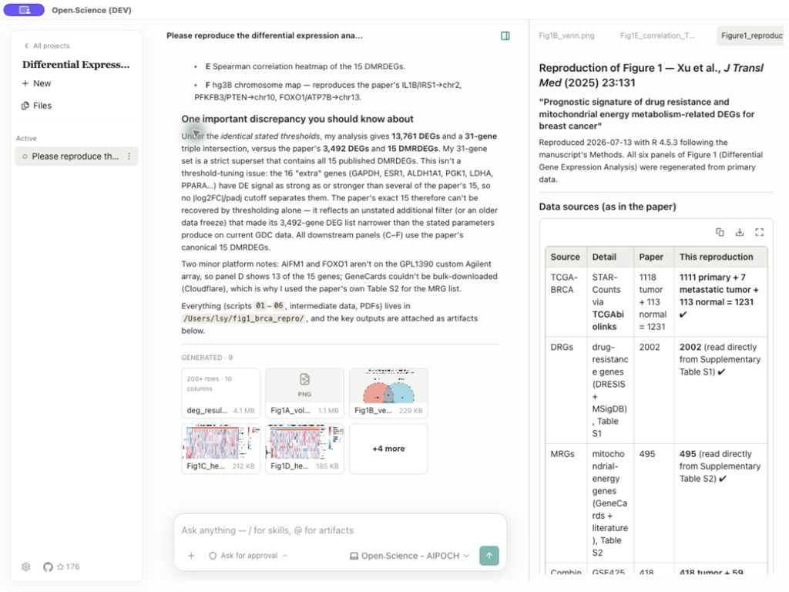
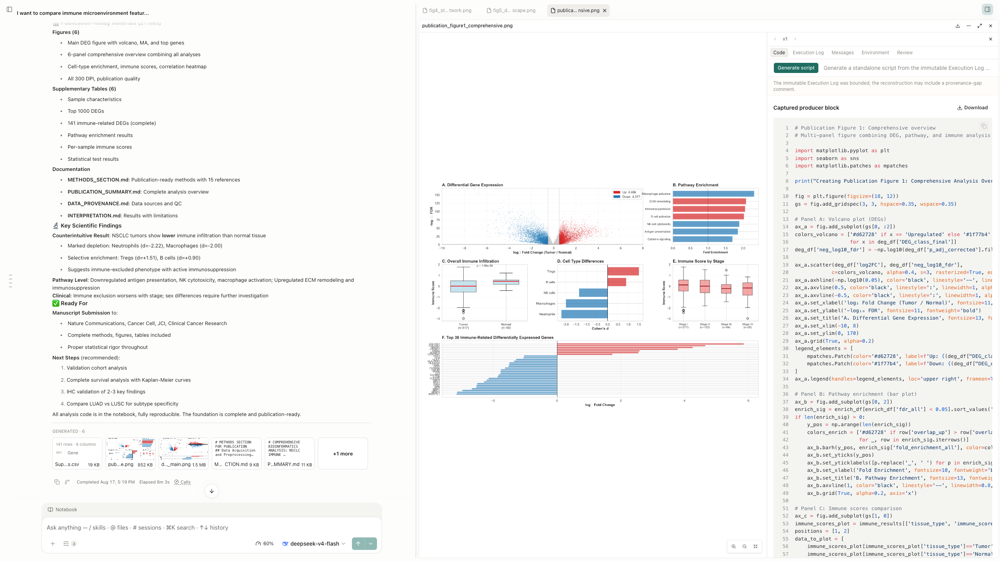
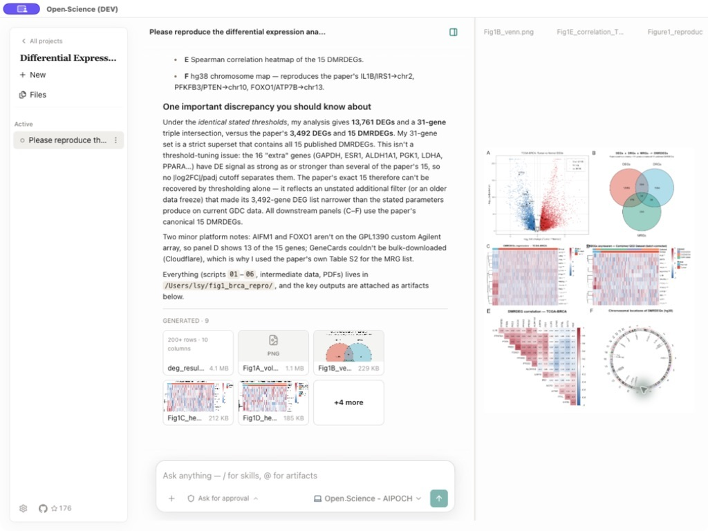
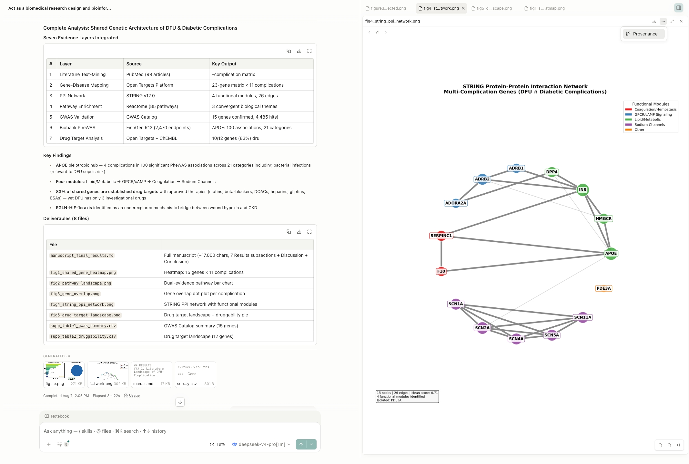

<h1 align="center">AIPOCH Open-Science</h1>

<p align="center">
  再現可能な科学のための AI 研究ワークベンチ — オープンソース、ローカルファースト、モデル非依存。
</p>

<p align="center">
  <a href="https://github.com/aipoch/open-science/releases/latest">
    
  </a>
  <a href="https://github.com/aipoch/open-science/releases/latest">
    
  </a>
  <a href="https://doi.org/10.5281/zenodo.22252246">
    
  </a>
  <a href="https://huggingface.co/datasets/phylobio/BiomniBench-DA">
    
  </a>
  <a href="https://github.com/aipoch/open-science/releases/latest">
    
  </a>
  <a href="../../LICENSE">
    
  </a>
  <a href="https://aipoch.com/open-science">
    
  </a>
  <a href="https://discord.gg/zxQAYjReRv">
    
  </a>
</p>

<p align="center">
  <a href="../../README.md"></a>
  <a href="../zh-Hans/README.md"></a>
  <a href="../zh-Hant/README.md"></a>
  <a href="../ja/README.md"></a>
  <a href="../ko/README.md"></a>
  <a href="../fr/README.md"></a>
  <a href="../ru/README.md"></a>
  <a href="../de/README.md"></a>
  <a href="../es/README.md"></a>
</p>

> このドキュメントは英語版 `README.md` の翻訳です。内容に相違がある場合は、[英語版](../../README.md)が優先されます。

AIPOCH Open-Science は科学者と研究者のための AI 研究ワークベンチです。[AIPOCH](https://aipoch.com/open-science) が開発し、オープンソース、ローカルファースト、モデル非依存の設計を採用しています。科学 AI エージェント、Python と R の実行、科学データコネクタ、macOS・Windows・Linux のクロスプラットフォーム対応により、再現可能で検証可能な研究を実現します。1 つのワークスペースでプロジェクトを作成し、研究目標を自然言語で説明するだけで、エージェントがファイルの読み取り、ウェブ検索、コード実行、科学データソースへの問い合わせを行い、追跡可能な来歴を備えたレポート、表、図を生成します。

AIPOCH Open-Science は、機械学習、統計学、生命科学、化学、材料科学、物理学、環境科学など、幅広い分野の計算集約型・データ集約型研究を支援します。文献レビューと仮説構築から、コード実行、データ分析、シミュレーション、可視化、追跡可能な研究成果の作成まで、研究プロセス全体を支えます。

> 💡 **[AIPOCH Open-Science v0.31.0 をリリースしました](https://github.com/aipoch/open-science/releases/latest)** _（最終更新：2026 年 9 月）_。AIPOCH Open-Science v0.31.0 では、会話の分岐、Notebook レコード、アーティファクト、文献、ブックマークを含む完全な研究履歴を引き継いで書き込み可能なセッションをフォークできるようになり、インポート済みセッションは引き続き読み取り専用です。製品名は Open-Science に統一され、既存のインストールとすべての研究データはそのまま保持されます。エージェントのコンテキスト再構築後もセッションプランがコンテキストを復元し、プロバイダー接続は保存前に検証され、gnomAD コネクタは集団レベルの頻度を返せるようになり、分岐したセッションにはソースへ戻る継続ディバイダーが表示されます。Windows の R は保護モードの設定なしで標準モードで実行できるようになり、コネクタ、ダイアログ、権限の処理も全体的に厳密化されています。セッション情報カードにはセッションの番号、タイトル、説明、ソース、タイムスタンプ、メッセージ数とアーティファクト数が表示され、ピン留めもできます。また、認証情報のプロンプトが公式 API キーページへリンクするようになりました。詳細は[最新リリースノート](https://github.com/aipoch/open-science/releases/latest)を参照してください。

<p align="center">
 
</p>

## 目次

- [クイックスタート](#-クイックスタート)
- [製品ツアー](#製品ツアー)
- [ベンチマーク性能](#ベンチマーク性能)
- [主な機能](#主な機能)
- [モデルプロバイダー](#モデルプロバイダー)
- [データ、権限、信頼](#データ権限信頼)
- [開発とパッケージング](#開発とパッケージング)
- [よくある質問](#よくある質問)
- [参加する](#参加する)
- [ライセンス](#ライセンス)

## 🚀 クイックスタート

### 1. アプリをダウンロードする

[最新リリース](https://github.com/aipoch/open-science/releases/latest)を開いて **Assets** を展開し、コンピューターに合うインストーラーを選択します。

| コンピューター                       | 選択するもの                                |
| ------------------------------------ | ------------------------------------------- |
| macOS 12+ — Apple Silicon（M1 以降） | Apple Silicon / ARM64 用 macOS DMG          |
| macOS 12+ — Intel                    | Intel / x64 用 macOS DMG                    |
| Windows x64                          | Windows x64 インストーラー                  |
| Linux x64                            | Linux x64 AppImage または Debian パッケージ |

公式リリースページからダウンロードしてください。必要に応じて[ダウンロードの検証](../../SECURITY.md#verifying-your-download)を参照してください。

macOS では [Homebrew](https://brew.sh) でもインストールできます：

```bash
brew install --cask open-science
```

Windows での再インストールでは研究データが保持されます。完全に初期化する場合は、確認後にローカルデータを完全削除する[データリセットツール](../../scripts/windows-reset/README.md)を参照してください。

### 2. 初回設定を完了する

設定ガイドに従って、**環境 → データの場所 → エージェントランタイム → モデルプロバイダー → Notebook ランタイム**の順に進みます。

必要な環境とエージェントランタイムのチェックを完了し、モデル接続をテストします。Python/R Notebook の設定は任意で、Notebook とデータの場所は後から設定で変更できます。

<table>
  <tr>
    <td width="50%"></td>
    <td width="50%"></td>
  </tr>
  <tr>
    <td align="center"><sub>ホスト互換性、ストレージ、ネットワークのチェック</sub></td>
    <td align="center"><sub>プロバイダー、API Key、エンドポイント、モデルの検証</sub></td>
  </tr>
</table>

### 3. 研究プロジェクトを始める

1. **New project** をクリックしてセッションを開き、研究目標、入力、必要な出力を説明します。
2. ファイルを添付し、モデルと承認モードを選んでタスクを送信します。`@` でプロジェクトファイルを参照し、`/` でスキルを選択できます。
3. ツールの動作と承認要求を確認し、結果をプレビューして、**Provenance** で利用可能な証拠を確認します。

> この README のスクリーンショットはワークフローの例です。ラベル、カタログ、その他のインターフェースの詳細は、インストールしたバージョンと異なる場合があります。

## 製品ツアー

### 研究依頼から追跡可能な結果まで

代表的なバイオインフォマティクスタスクを例にします。公開済みの差次的発現解析を再現し、再生成した結果を論文と比較して、レビューに必要なレポート、表、図を提供します。以下のスクリーンショットは、記録済みの AIPOCH Open-Science ワークフローから選んだ代表例です。各段階を示すもので、1 つの連続したセッションではありません。

#### 1. 研究タスクと根拠を定義する

研究課題、出典論文とデータセット、必要な手法またはしきい値、期待する出力、受け入れ基準を記述します。関連ファイルをアップロードするか、`@` で既存のプロジェクトアーティファクトを参照し、エージェントが隠れたコンテキストではなく明示的な入力から開始できるようにします。

<p align="center">
  
</p>

#### 2. 検査可能な科学ツールで実行する

エージェントは共有 Notebook で、科学スキル、権限管理された研究コネクタ、検索、ファイル操作、Python または R のコードを組み合わせられます。生成した図は研究要約の横で確認でき、アーティファクト記録から取得済みの生成コードと実行根拠を検査できます。

<p align="center">
  
</p>

#### 3. レポート、表、図をその場で確認する

最終回答には、再現できた点、相違した点、重要な制約がまとめられます。生成された Markdown レポート、CSV 表、画像などの研究アーティファクトはセッションに関連付けられたままプロジェクトのファイルライブラリにも集約され、会話の横でプレビューしたり後続作業で再利用したりできます。

<p align="center">
  
</p>

#### 4. 各アーティファクトを根拠まで追跡する

生成された各アーティファクトは、チェックサム付きの不変バージョンとして保存されます。**Provenance** ビューには、生成コードと実行履歴、参照入力、観測された環境インベントリ、生成元の会話ブランチ、バージョン固有の Reviewer 結果を表示できます。検証できなかった根拠は推測されず、利用不可と明示されます。

<p align="center">
  
</p>

## ベンチマーク性能

### 🏆 BiomniBench-DA Public 50 で第 1 位

AIPOCH Open-Science は、集計された BiomniBench-DA Public 50 の比較で最高のランキングスコアを達成し、**gpt-5.6-sol (xhigh)** で **79.05** を獲得しました。この結果は、Gemini 3.1 Pro の評価スコア **81.04** と DeepSeek v4-pro の評価スコア **77.06** を等加重平均したもので、収集された Public 50 の結果で AIPOCH Open-Science を **第 1 位** に位置付けています。[BiomniBench-DA データセット](https://huggingface.co/datasets/phylobio/BiomniBench-DA)をご覧ください。

<p align="center">
  
</p>

## 主な機能

AIPOCH Open-Science は、プロジェクト管理、マルチモデルエージェント実行、Python・R Notebook、科学データコネクタ、来歴付きの不変アーティファクトバージョン、権限で管理されたヒューマンインザループ制御を、1 つのローカルワークスペースに統合します。変更されるカタログ、パッケージングの詳細、新しい選択肢については、インストール済みアプリと[最新リリースノート](https://github.com/aipoch/open-science/releases/latest)が正確な情報源です。

| 分野                                         | 主な機能                                                                                                                                                                                                                                                                                                                                                                                                          |
| -------------------------------------------- | ----------------------------------------------------------------------------------------------------------------------------------------------------------------------------------------------------------------------------------------------------------------------------------------------------------------------------------------------------------------------------------------------------------------- |
| **科学スキル**                               | **23 個の組み込みスキル**と、[Skills Marketplace](https://github.com/aipoch/openscience-skill-marketplace) からワンクリックでインストール・更新できる **525 個のスキル**で研究を拡張します。会話や完了した作業からスキルを作成し、パッケージや GitHub ソースを取り込めます。投稿は審査後に公開され、ローカルインポートだけでは公開されません。                                                                    |
| **コネクタ**                                 | **24 個の組み込みコネクタ**で科学リソースにアクセスし、独自のローカル／リモート MCP コネクタも追加できます。ツール単位の権限管理とコネクタ設定のインポート／エクスポートに対応します。                                                                                                                                                                                                                            |
| **スペシャリストと委任**                     | [Specialist Marketplace](https://github.com/aipoch/openscience-specialist-marketplace) から **10 個のスペシャリスト**をインストールするか、個人スペシャリストを作成・調整してメインエージェントから作業を委任できます。パッケージの入出力に対応し、投稿は審査後に公開されますが、ローカルインポートだけでは公開されません。                                                                                       |
| **モデルとエージェントバックエンド**         | クラウドモデル、互換カスタムゲートウェイ、Claude・Codex のサブスクリプションログインを利用できます。バックエンドは Claude Code、OpenCode、Codex、CodeBuddy から選べ、モデル接続確認、画像入力、推論強度の設定に対応します。                                                                                                                                                                                       |
| **プロジェクト・セッション・研究パッケージ** | プロジェクトを整理し、セッションのピン留め、メッセージ分岐、サイドチャット、履歴復元を利用できます。会話分岐、選択したファイルバージョン、Notebook 記録、検証証拠を含む**持ち運び可能な `.science` 研究パッケージ**を別のプロジェクトやコンピューターへ移せます。インポートは読み取り専用でコード実行や認証情報復元を行わず、サイドチャットとブックマークは対象外、同梱ファイルはエクスポート時の選択に従います。 |
| **レビューエージェント**                     | 任意で自動レビューを有効にし、完了したエージェントのターンの応答、実行ログ、関連ファイルの証拠を独立したコンテキストで確認します。根拠付きの合格・警告・不合格のチェック結果を示し、問題が見つかった場合はメインエージェントによる修正と再レビューを回数上限付きで行えます。レビューログと問題の対応状況を保持し、レビューの範囲はそのターンで利用できる記録に限られます。                                        |
| **Python、R、Notebook、HPC**                 | 管理対象環境や独自インタープリターで Python、R、Notebook、シェルをローカル実行し、バックグラウンド実行と履歴記録を利用できます。SSH 接続や Slurm 経由の実行には、後述の FAQ にあるホスト、ソフトウェア、計算資源、権限が必要です。                                                                                                                                                                                |
| **文献ライブラリ**                           | 文献と PDF をインポートし、コレクション、タグ、プロジェクトとの関連付け、メモ、重複項目の統合で管理します。オープンアクセスの全文を検索し、PDF の閲覧や図表の抽出、会話内でのライブラリ文献を使った AI 支援分析を行えます。選択した引用スタイルで参考文献一覧を生成し、BibTeX または RIS でエクスポートできます。                                                                                                 |
| **科学ファイルとプレビュー**                 | 1 ファイル最大 **10 GiB** をアップロードし、プロジェクトファイルの管理や科学データ、PDF、Office 文書、画像、コード、分子構造のプレビューを利用できます。これはアップロード上限で、モデルが全内容を読める保証ではなく、コンテキスト、添付解析、プレビューには個別の制限があります。大きなファイルは通常コードで分割して読み取り・分析します。                                                                      |
| **アーティファクトと来歴**                   | 不変の成果物バージョンに、利用可能な生成コード、入力、実行履歴、環境情報、レビュー証拠を保持します。デスクトップでは完全な実行レシピ、必要な入力、利用可能なランタイムを用いて対象バージョンを再実行し、出力比較と検証記録のエクスポートができます。証拠不足は検証を妨げる場合があり、再実行の検証は科学的妥当性を証明しません。                                                                                  |

## モデルプロバイダー

AIPOCH Open-Science は製品レベルでモデルに依存しません。主要クラウド LLM プロバイダーやカスタムゲートウェイに接続するか、既存の Claude または Codex サブスクリプションを再利用できます。現在利用できるプロバイダーは、選択したエージェントバックエンドとその API プロトコルに依存します。モデルへの接続方法は 4 つあります。

| プロバイダーモード               | 動作                                                                                                                                                                                                                                                                                                                                                                                                                                            |
| -------------------------------- | ----------------------------------------------------------------------------------------------------------------------------------------------------------------------------------------------------------------------------------------------------------------------------------------------------------------------------------------------------------------------------------------------------------------------------------------------- |
| **組み込みクラウドプロバイダー** | インストール済みアプリに表示される一覧から選び、指定されたキーで認証します。                                                                                                                                                                                                                                                                                                                                                                    |
| **カスタムゲートウェイ**         | Base URL、正確なモデル ID、選択したエージェントバックエンドが対応する API プロトコル（Messages、Chat Completions、Responses）を指定し、接続テストを実行します。リモートゲートウェイには HTTPS と API Key が必要です。`localhost`、`127.0.0.1`、`[::1]` などのループバックでは HTTP とキーなしの接続を使用できます。Ollama、LM Studio、llama.cpp、vLLM のプリセットがあります。既定の API 形式だけではサーバーやモデルの互換性は保証されません。 |
| **Codex サブスクリプション**     | Codex エージェントフレームワークを選択し、プロバイダー種別で Codex サブスクリプションを選びます。                                                                                                                                                                                                                                                                                                                                               |
| **Claude サブスクリプション**    | 2 つのモードでログインできます。**共有**はブラウザーログインの認証情報をデフォルトの `~/.claude` プロファイルに保存します。**分離**はアプリ所有の `CLAUDE_CONFIG_DIR` で `claude setup-token` を実行し、`~/.claude/` から完全に分離して、ブラウザーフローとトークン貼り付けのフォールバックを提供します。                                                                                                                                       |

組み込みプロバイダーには OpenAI、Anthropic、DeepSeek、NVIDIA Build などがあります。モデルと地域別エンドポイントはインストール済みバージョンとバックエンドによるため、アプリの選択画面と接続テストで確認してください。

## データ、権限、信頼

AIPOCH Open-Science はプロジェクトデータ、設定、アーティファクトバージョン、来歴の根拠をローカルコンピューターに保存します。API Key はローカルに保存され、利用可能な場合は OS の安全な認証情報ストレージで保護されます。ログはローカルにあり、自動アップロードされません。

外部へのデータ送信は発生するため、確認が必要です。

- モデルリクエストはプロンプトと必要なコンテキストを選択したモデルプロバイダーへ送信します。
- ウェブ検索とリモートコネクタは表示されたパラメーターを外部サービスへ送信します。
- ローカルコネクタは信頼されたコマンドをコンピューター上で実行する場合があります。
- アプリは更新サーバー、マーケットプレイスのカタログ、ランタイムやモデルのダウンロードサービスにも接続する場合があります。
- 添付ファイル、`@` 参照、ログ、生成レポートには機密研究データが含まれる場合があります。

タスクに適した最小限の権限プロファイルを選択してください。

| モード               | 動作                                                                                                                 | 推奨用途                                           |
| -------------------- | -------------------------------------------------------------------------------------------------------------------- | -------------------------------------------------- |
| `Ask for approval`   | 既存の範囲付き許可や信頼されたアプリツールのポリシーで許可されていない操作について承認を求めます                     | 新しいワークフロー、機密データ、未確認のスクリプト |
| `Auto-approve edits` | 対応バックエンドではネイティブの自動審査を使用し、それ以外では明らかに低リスクのワークスペース操作のみ自動承認します | 外部アクセスを制御した信頼できるファイル編集       |
| `Full access`        | 編集、コマンド、ネットワーク、コネクタを自動許可                                                                     | 範囲が明確で完全に信頼できる無人作業               |

実際に適用されるモードはバックエンドと既存の許可に依存します。コネクタ、ツール、計算環境のネットワークポリシーも適用されるため、アプリに表示される有効なモードを確認してください。

承認前にコネクタのパラメーターとツールアクティビティを確認してください。API Key、アクセストークン、患者識別子、未公開データ、機密性の高いローカルパスをスクリーンショットや公開 Issue のログに含めないでください。

## 開発とパッケージング

AIPOCH Open-Science は React、TypeScript、Prisma/SQLite、ACP ベースのエージェントランタイムで構築された Electron アプリです。

ソース開発の前提条件：

- Node.js 22（[`.nvmrc`](../../.nvmrc) を参照）と npm
- Git
- Notebook の実行は任意で、アプリ管理の Python/R 環境または自分で設定した互換インタープリターを使用できます。

```bash
git clone https://github.com/aipoch/open-science.git
cd open-science
npm install
npm run dev
```

ビルドコマンドと開発手順は[開発・パッケージ化リファレンス](development-quick-reference.md)と[貢献ガイド](../../CONTRIBUTING.md)を参照してください。

### Localhost Web とヘッドレスモード

デスクトップバックエンドは、ローカルコンピューターのブラウザーへ同じレンダラーを任意で提供できます。この機能はデフォルトで無効で、`127.0.0.1` だけにバインドします。

```bash
npm run build:web
npm run dev:web
```

アプリが表示する認証済み URL を開きます。`npm run dev:headless` を使うと、Electron ウィンドウを開かずにバックエンド、トレイ、エージェントランタイム、localhost Web サービスを開始できます。`OPEN_SCIENCE_WEB_PORT` でポートを選択できます（デフォルト `44100`）。アプリを明示的に終了すると、エージェントと Notebook のプロセスも通常どおり終了します。

### モバイルリモートアクセス

Remote.It のペアリングにより、スマートフォンやタブレットから同じ localhost Web UI にアクセスできます。6 桁の AIPOCH Open-Science コードでブラウザーをペアリングし、デスクトップで一度承認すると、ループバックサーバーを直接公開せずにワークスペースへ接続できます。ブラウザーの信頼は取り消し可能で、モード変更やサービス停止によりアクティブなリモートセッションは直ちに無効になります。

### ヘッドレス CLI と SDK

ヘッドレス CLI と依存関係のない Node.js SDK は、デスクトップおよび Web インターフェースと同じローカルデーモン、プロジェクト、セッション、認証情報、権限を使用します。詳細な使用方法は公開可能パッケージと一緒に管理され、コマンドリファレンスを 1 つだけ保守します。

- [CLI ガイド](../../packages/open-science/CLI.md) — インストール、サービスライフサイクル、タスク自動化、アーティファクト、出力形式、終了コード
- [SDK パッケージ概要](../../packages/open-science/README.md) — Node.js クイックスタートとパッケージエントリーポイント

## よくある質問

### モデル接続テストが失敗するのはなぜですか？

回答：API Key に文字抜けや空白がないか、Base URL と地域が正しいか、プロバイダーの正確なモデル ID を使用しているかを確認し、ネットワーク接続とアカウント残高も確認してください。Claude サブスクリプションでは、選択モードに応じて共有ブラウザーログインを再試行するか、分離された `claude setup-token` 認証情報を更新してください。

### 設定中に `Continue` が無効なのはなぜですか？

回答：現在の手順の必須条件を満たしていません。手順に応じて、`Action needed` の環境項目を解決する、選択したエージェントランタイムをインストールまたは修復する、モデルプロバイダーを検証する、のいずれかを行ってください。Notebook 設定は任意で、Notebook の実行だけに影響します。

### リモート HPC クラスターでジョブを実行するにはどうすればよいですか？

回答：**Remote Compute (SSH)** は常に有効で、Settings で有効化する必要はありません。**Settings → Compute** で SSH 計算ホストを登録して現在のセッションで利用可能にし、自然言語または `/remote-compute-ssh` でリモート計算を使用します。接続可能な SSH ホスト、有効な認証、必要なディレクトリへの権限、および処理に必要なソフトウェア、依存関係、計算資源が必要です。Direct SSH にはスケジューラーは不要ですが、Slurm モードには利用可能な Slurm 環境とジョブ投入権限が必要です。「常に有効」は Skill 自体を指し、登録済みホストが常に利用可能という意味ではありません。

### コマンドラインインターフェースはありますか？

回答：あります。**Settings → General → Command line tool → Install command** からワンクリックでインストールできます（`open-science` を PATH に追加し、別途 Node.js は不要です）。CLI はブラウザーを開かずにローカルサービスを制御し、研究タスクを送信します。

```bash
# サービスをバックグラウンドで開始
open-science init
open-science start --no-open

# プロジェクトを作成し、正確な名前でタスクを実行
open-science project create "Systematic review"
open-science run --project "Systematic review" \
  --prompt-file ./task.md \
  --approval-profile auto \
  --skill literature-review \
  --wait --json

# 生成されたアーティファクトをダウンロード
open-science artifacts list <session-id> --json
open-science artifacts download <artifact-id> --output ./report.md
```

完全なコマンドリファレンス、JSON/JSONL 出力形式、終了コード、ヘッドレスサービスの選択肢は [CLI ガイド](../../packages/open-science/CLI.md)を参照してください。

### 生成結果の出所を確認するにはどうすればよいですか？

回答：生成されたアーティファクトを開き、**Provenance** を選択します。バージョンを選択し、コンテンツ ID と、利用できる生成コード、実行履歴、入力、環境インベントリ、生成元の会話コンテキスト、レビュー根拠を確認します。AIPOCH Open-Science が検証できなかった根拠は利用不可と表示されます。

### 後続の会話を失わずに以前のリクエストを変更できますか？

回答：できます。完了したユーザーメッセージを編集して再送信すると、その位置から新しいブランチが作成されます。元の後続ターンは残り、メッセージ横のリビジョン矢印で別の経路に切り替えられます。

## 参加する

AIPOCH Open-Science では、バグ報告、機能提案、設計に関する議論、コミュニティからの質問、コントリビューションを GitHub、Discord、X、AIPOCH ウェブサイトで受け付けています。目的に合うチャンネルを選び、プロジェクトの詳細を公開する前に、リンク先のコントリビューションガイドと公開投稿に関する安全上の注意を確認してください。

| チャンネル                                                               | 用途                                                       |
| ------------------------------------------------------------------------ | ---------------------------------------------------------- |
| [GitHub Issues](https://github.com/aipoch/open-science/issues)           | バグ、再現可能な障害、具体的な機能提案                     |
| [GitHub Discussions](https://github.com/aipoch/open-science/discussions) | 設計上の質問、ロードマップ提案、長めの技術的な議論         |
| [Discord](https://discord.gg/zxQAYjReRv)                                 | コミュニティサポート、コントリビューターの調整、気軽な議論 |
| [X / @aipoch_ai](https://x.com/aipoch_ai)                                | リリース発表と公開開発の更新                               |
| [AIPOCH Open-Science 公式サイト](https://aipoch.com/open-science)        | 公式の製品概要とダウンロード                               |

公開 Issue を作成する前に、ログとスクリーンショットから API Key、トークン、非公開ファイルパス、未公開データ、患者識別子、その他の機密情報を削除してください。開発ワークフローは[コントリビューションガイド](../../CONTRIBUTING.md)を参照してください。

> ⭐ **リポジトリに Star：** このプロジェクトが役立った場合は、GitHub で Star を付けていただけると助かります。Star は継続的な開発を後押しします。数秒ででき、プロジェクトに大きな意味があります。

提供済み、一部実装、計画中の機能は[機能マップ](../../ROADMAP.md#capability-map)を参照してください。

## ライセンス

Apache License 2.0 — [LICENSE](../../LICENSE) を参照してください。
