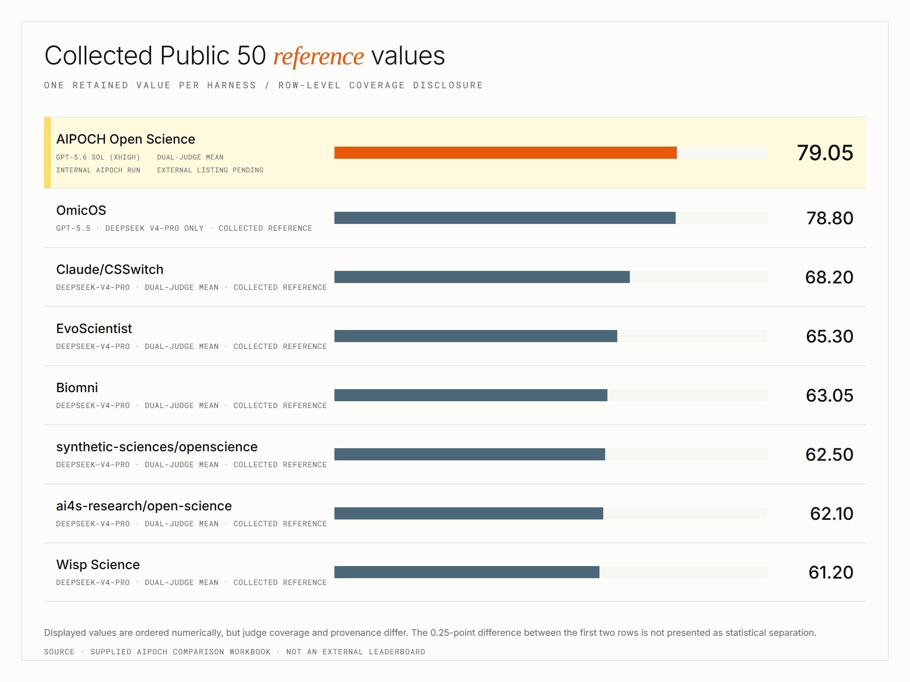

# Open Science — открытая рабочая среда для исследований с научными ИИ-агентами

[](https://github.com/aipoch/open-science/releases/latest)
[](https://github.com/aipoch/open-science/releases/latest)
[](https://doi.org/10.5281/zenodo.22252246)
[](https://huggingface.co/datasets/phylobio/BiomniBench-DA)
[](https://github.com/aipoch/open-science/releases/latest)
[](../../LICENSE)
[](https://aipoch.com/open-science)
[](https://discord.gg/zxQAYjReRv)

<p align="center">
  <a href="../../README.md"></a>
  <a href="../zh-Hans/README.md"></a>
  <a href="../zh-Hant/README.md"></a>
  <a href="../ja/README.md"></a>
  <a href="../ko/README.md"></a>
  <a href="../fr/README.md"></a>
  <a href="../ru/README.md"></a>
  <a href="../de/README.md"></a>
  <a href="../es/README.md"></a>
</p>

> Это перевод англоязычного файла README. При расхождениях [английская версия](../../README.md) имеет приоритет.

Open Science — это разработанная [AIPOCH](https://aipoch.com/open-science) для учёных и исследователей открытая, локальная и не зависящая от модели рабочая среда для исследований с ИИ. Она помогает вести воспроизводимые и прозрачные исследования с научными ИИ-агентами, выполнением кода на Python и R, коннекторами научных данных и поддержкой macOS, Windows и Linux. Создайте проект, опишите исследовательскую задачу обычным языком, и агенты смогут читать файлы, искать информацию в интернете, выполнять код, обращаться к научным источникам данных и готовить отчёты, таблицы и графики с прослеживаемым происхождением — всё в одном рабочем пространстве.

Open Science подходит для вычислительных исследований и анализа больших объёмов данных в машинном обучении, статистике, науках о жизни, химии, материаловедении, физике, науках об окружающей среде и других областях. Приложение поддерживает весь исследовательский процесс: от обзора литературы и формулирования гипотез до выполнения кода, анализа данных, моделирования, визуализации и подготовки проверяемых результатов.

> 💡 **[Вышла Open Science v0.25.1](https://github.com/aipoch/open-science/releases/latest)** _(последнее обновление: сентябрь 2026 г.)_. Open Science v0.25.1 — технический выпуск: защищённые ядра Notebook теперь запускаются напрямую в Windows, экспорт файлов публикуется атомарно с метками времени пакетов, корректными в любом часовом поясе, предпросмотры созданных изображений восстановлены, а по всему приложению внесён широкий набор исправлений сессий, артефактов, специалистов и поставщиков. Полный список изменений приведён в [примечаниях к последнему выпуску](https://github.com/aipoch/open-science/releases/latest).

<p align="center">
 
</p>

## Содержание

- [Быстрый старт](#-быстрый-старт)
- [Обзор продукта](#обзор-продукта)
- [Результаты тестирования](#результаты-тестирования)
- [Зачем нужен Open Science](#зачем-нужен-open-science)
- [Принципы проектирования](#принципы-проектирования)
- [Основные возможности](#основные-возможности)
- [Поставщики моделей](#поставщики-моделей)
- [Данные, разрешения и доверие](#данные-разрешения-и-доверие)
- [Состояние проекта](#состояние-проекта)
- [Разработка и сборка](#разработка-и-сборка)
- [Планы развития](#планы-развития)
- [Место в экосистеме AIPOCH](#место-в-экосистеме-aipoch)
- [Чем Open Science не является](#чем-open-science-не-является)
- [Частые вопросы](#частые-вопросы)
- [Как принять участие](#как-принять-участие)
- [Лицензия](#лицензия)

## 🚀 Быстрый старт

Запустить Open Science можно за три шага: скачайте установщик для своей платформы, пройдите первоначальную настройку и создайте исследовательский проект.

### 1. Скачайте приложение

Откройте страницу [последнего выпуска](https://github.com/aipoch/open-science/releases/latest), разверните раздел **Assets** и выберите установщик для своего компьютера:

| Ваш компьютер                        | Что выбрать                             |
| ------------------------------------ | --------------------------------------- |
| macOS — Apple Silicon (M1 или новее) | DMG для macOS на Apple Silicon / ARM64  |
| macOS — Intel                        | DMG для macOS на Intel / x64            |
| Windows x64                          | Установщик для Windows x64              |
| Linux x64                            | AppImage или пакет Debian для Linux x64 |

Ознакомьтесь со списком файлов и сведениями о проверке на странице выпуска. Если перед установкой нужно проверить пакет, см. раздел [«Проверка загруженного файла»](../../SECURITY.md#verifying-your-download).

> Если macOS или Windows предупреждает о неизвестном разработчике или издателе, прежде чем продолжить, убедитесь, что пакет скачан с официальной страницы Releases.

### 2. Пройдите первоначальную настройку

При первом запуске приложение проведёт вас через пять этапов:

1. **Среда** — проверка совместимости, хранилища приложения, защищённого хранилища учётных данных и доступа к сети.
2. **Расположение данных** — выбор папки для крупных артефактов, Notebook, загруженных файлов и сред выполнения.
3. **Среда выполнения агента** — выбор и подготовка Claude Code, OpenCode или Codex. Управляемые приложением среды можно установить без Node.js, npm и пароля администратора.
4. **Поставщик моделей** — подключение и проверка нужной модели. Можно выбрать встроенного поставщика, собственный шлюз или существующую подписку Claude либо Codex.
5. **Среда выполнения Notebook** — необязательная подготовка управляемых приложением сред Python и R либо подключение обнаруженных или вручную зарегистрированных интерпретаторов.

<table>
  <tr>
    <td width="50%"></td>
    <td width="50%"></td>
  </tr>
  <tr>
    <td align="center"><sub>Проверка совместимости компьютера, хранилища и сети</sub></td>
    <td align="center"><sub>Проверка поставщика, API-ключа, адреса и модели</sub></td>
  </tr>
</table>

Notebook необязателен. Кнопка «Продолжить» станет доступна только после успешного прохождения всех обязательных проверок среды и среды агента, а настройка завершится только после проверки подключения к модели. Для Notebook и расположения данных можно оставить значения по умолчанию и изменить их позже в настройках.

### 3. Создайте исследовательский проект

1. Нажмите **«Новый проект»**, задайте устойчивое название исследования и при необходимости добавьте описание.
2. Откройте сессию и опишите цель, исходные данные, ограничения, ожидаемый результат и способ его проверки.
3. Прикрепите исходные файлы, выберите проверенную модель и профиль разрешений.
4. Отправьте задачу. Следите за действиями агента и инструментов, подтверждайте чувствительные операции и открывайте созданные артефакты на панели предпросмотра.
5. Чтобы проверить другое направление, отредактируйте предыдущее сообщение пользователя и отправьте его в новой ветке; переключаться между вариантами можно элементами управления версиями сообщения.
6. Откройте представление **«Происхождение»** для артефакта, чтобы изучить его версии и доступные свидетельства, связанные с выбранным результатом.
7. Продолжайте работу в следующих сессиях. Используйте `@`, чтобы сослаться на файл проекта, и `/`, чтобы явно выбрать включённый навык.

> Снимки экрана в этом README показывают общий рабочий процесс. Надписи, каталоги и другие детали интерфейса могут отличаться от установленной версии.

## Обзор продукта

Open Science объединяет исследования в проекты и сессии, чтобы каждый результат оставался связан с данными и действиями, которые к нему привели. Ниже показаны рабочее пространство, происхождение артефактов, предпросмотр, научные навыки и коннекторы данных.

### Единое рабочее пространство: от задачи до прослеживаемых артефактов

В проекте вместе хранятся связанные сессии, загруженные и созданные файлы и состояние предпросмотра. В диалоге сохраняются ответ агента, команды, прочитанные и изменённые файлы, поисковые запросы и вызовы коннекторов, которые привели к результату. Каждый созданный артефакт хранится как неизменяемая версия с контрольной суммой. В представлении **«Происхождение»** отображаются свидетельства, которые Open Science удалось проверить на момент создания: код и история выполнения, использованные исходные данные, наблюдаемый состав среды, ветка диалога и замечания рецензента для конкретной версии. Если свидетельства отсутствуют, приложение прямо сообщает об этом, а не пытается их восстановить догадками.

<table>
  <tr>
    <td width="50%"></td>
    <td width="50%"></td>
  </tr>
  <tr>
    <td align="center"><sub>Загруженные и созданные файлы по проектам и сессиям</sub></td>
    <td align="center"><sub>Встроенный предпросмотр сохраняет данные рядом с историей исследования</sub></td>
  </tr>
</table>

Созданные отчёты, графики и таблицы остаются прикреплены к сессии и одновременно попадают в библиотеку файлов проекта. Вкладки предпросмотра сохраняют активный результат при изменении размера панели, а длинные имена файлов не теряют различимый суффикс и расширение. Open Science умеет показывать распространённые форматы научных данных, PDF, документы Office (DOCX, XLSX, PPTX), изображения с масштабированием и панорамированием, исходный код с подсветкой синтаксиса, молекулярные структуры и реакции, а также историю Notebook. Ограничения предпросмотра не обрезают исходный файл: полный артефакт остаётся доступен агенту и внешним инструментам. Сочетание `Cmd/Ctrl+F` ищет по диалогам, выводу Notebook и отрисованным страницам во всём рабочем пространстве, а `Cmd/Ctrl+K` открывает палитру команд текущего проекта. Доступна и тёмная тема: выберите её в разделе **«Настройки → Общие»**, и оформление всего приложения, диалога и средств просмотра изменится без мерцания. Язык интерфейса можно переключить во время работы; поддерживаются немецкий, испанский, упрощённый и традиционный китайский, японский, корейский, французский и русский.

### Новая ветка диалога без потери исходной

Отредактируйте завершённое сообщение пользователя, чтобы с этого места отправить уточнённый запрос. Open Science создаст новую ветку сообщений, не удаляя последующие реплики, а элементы управления версиями позволят переключаться между исходным и альтернативным путями. Выбранная ветка, действия инструментов, вложения и созданные артефакты сохраняются при переходе между проектами и после перезапуска. Происхождение каждой версии артефакта связано с конкретной веткой, поэтому проверка другой гипотезы не размывает историю предыдущего результата.

### Научные навыки и коннекторы данных

В Open Science входит растущий каталог из **18 рекомендуемых** файловых исследовательских навыков: AlphaFold2, Boltz, Borzoi, Chai-1, DiffDock, Environment & Packages, ESM-2, ESMFold2, Evo 2, Indication Dossier, LigandMPNN, Literature Review, OpenFold3, ProteinMPNN, scGPT, scvi-tools, SolubleMPNN и **Remote Compute (SSH)** для отправки длительных заданий на удалённые кластеры HPC и получения результатов. Можно создавать личные навыки, загружать пакеты `SKILL.md`, ZIP и `.skill`, просматривать и импортировать совместимые навыки из GitHub с необязательной аутентификацией или импортировать навыки, уже установленные в глобальных каталогах агентов. Агент также может запросить импорт пакета из вложения сессии или общедоступного URL GitHub; прежде чем что-либо будет записано, приложение покажет собственный предпросмотр и запросит подтверждение. Включённый навык можно выбрать непосредственно в поле ввода с помощью `/`.

Также доступны **24 встроенных** исследовательских коннектора: Literature Graph, PubMed, bioRxiv, Genes & Ontologies, Genomes, BioMart, Variants, Human Genetics, Clinical Genomics, Structures & Interactions, Protein Annotation, Expression, Omics Archives, CellGuide, Regulation, RNA, Chemistry, ChEMBL, ZINC, Molecule Viewer, Clinical Trials, Drug Regulatory, Cancer Models и Research Resources. Встроенные и пользовательские коннекторы подчиняются системе разрешений: для каждого инструмента можно выбрать «Всегда разрешать», «Спрашивать каждый раз» или «Заблокировать». Актуальные каталоги навыков, коннекторов и инструментов доступны в установленном приложении.

<table>
  <tr>
    <td width="50%"></td>
    <td width="50%"></td>
  </tr>
  <tr>
    <td align="center"><sub>Понятные и многократно используемые исследовательские навыки</sub></td>
    <td align="center"><sub>Научные базы данных как инструменты агента с управляемыми разрешениями</sub></td>
  </tr>
</table>

## Результаты тестирования

### 🏆 № 1 в BiomniBench-DA Public 50

Open Science получил наивысший рейтинговый балл в сводном сравнении BiomniBench-DA Public 50 — **79.05** при использовании **gpt-5.6-sol (xhigh)**. Результат представляет собой среднее с равными весами между оценкой Gemini 3.1 Pro (**81.04**) и оценкой DeepSeek v4-pro (**77.06**), благодаря чему Open Science занимает **1-е место** среди собранных результатов Public 50. Ознакомьтесь с [набором данных BiomniBench-DA](https://huggingface.co/datasets/phylobio/BiomniBench-DA).

<p align="center">
  
</p>

## Зачем нужен Open Science

Open Science объединяет исследовательские задачи, выполнение, файлы и подтверждающие материалы в одном локальном настольном рабочем пространстве, доступном для проверки.

Исследовательская работа обычно распределена между чатами, Notebook, локальными скриптами, научными базами данных, файловыми менеджерами и средствами подготовки отчётов. При каждом переходе теряется контекст, а ответ нередко оказывается отделён от создавших его кода и файлов.

Open Science объединяет всё это в одном прозрачном настольном рабочем пространстве:

- **Работа сохраняется.** Проекты, сессии, черновики, файлы, предпросмотры и история выполнения переживают перезапуск приложения.
- **Не только советы, но и выполнение.** С разрешения пользователя агент может запускать команды, Python и R, изменять файлы, искать информацию, вызывать коннекторы и создавать артефакты.
- **Альтернативные пути без потери работы.** Измените более ранний запрос в новой ветке сообщений и переключайтесь между получившимися направлениями исследования.
- **Прослеживаемые результаты.** Неизменяемые версии артефактов сохраняют проверенные Open Science свидетельства их создания и явно отмечают недоступные сведения.
- **Выбор моделей.** Используйте встроенного облачного поставщика, совместимый пользовательский шлюз или подписку Claude либо Codex; модель и поддерживаемая ею глубина рассуждений выбираются для каждой сессии в поле ввода.
- **Локальное владение данными.** Приложение и состояние проекта находятся на вашем компьютере; внешние обращения выполняются только через явно настроенные или одобренные сервисы.
- **Прозрачность.** Исходный код, навыки, определения коннекторов, действия инструментов, созданные файлы и происхождение артефактов доступны для проверки.
- **Расширяемость.** Добавляйте навыки и MCP-коннекторы, не дожидаясь закрытого плана развития плагинов.
- **Без лицензий на рабочие места.** Open Science распространяется по Apache-2.0. Вы платите только за выбранную модель или инфраструктуру.

Open Science — независимый продукт, созданный с нуля. Это не прокси, не неофициальный клиент и не переоформленная версия другого исследовательского ИИ-приложения.

## Принципы проектирования

Open Science следует семи принципам, определяющим взаимодействие кода, данных, моделей и человеческого контроля: открытость по умолчанию, явная совместимость с разными поставщиками, локальное владение данными, участие человека в принятии решений, долговечные исследовательские записи, составные возможности и честное обозначение научных границ.

- **Открытость по умолчанию.** Исходный код, форматы, коннекторы и навыки должны оставаться доступными для изучения и создания ответвлений.
- **Разные поставщики с явной совместимостью.** Приложение проверяет настройки поставщика и показывает требования к адресу, а не считает все протоколы API взаимозаменяемыми.
- **Локальный подход с учётом данных.** Состояние проекта хранится локально, внешние потоки данных видимы, а автономная работа включается только по желанию пользователя.
- **Человек принимает решения.** Изменения файлов, команды, доступ к сети и вызовы коннекторов регулируются явными профилями разрешений.
- **Долговечные исследовательские записи.** Сессии, действия инструментов, история Notebook и неизменяемые версии артефактов остаются доступными для проверки после завершения запуска; отсутствующие свидетельства обозначаются прямо.
- **Составные возможности.** Навыки, коннекторы, модели, средства предпросмотра и будущие вычислительные системы должны быть заменяемыми компонентами, а не единым чёрным ящиком.
- **Честные научные границы.** Созданный результат не заменяет экспертную оценку, статистическую проверку и сверку с первичными источниками.

## Основные возможности

Open Science объединяет управление проектами, работу агентов с разными моделями, Notebook на Python и R, коннекторы научных данных, неизменяемые версии артефактов с происхождением и управляемый человеком контроль в одном локальном рабочем пространстве. Актуальные каталоги, сведения о сборках и новые параметры следует проверять в установленном приложении и [примечаниях к последнему выпуску](https://github.com/aipoch/open-science/releases/latest).

| Область                         | Основные возможности                                                                                                                                                                                                                                                                                                                                                                                                                                                                                                                                                                                                                                                                                                                                                                                                                                                                                                                                                                                                                                                                                                                                                                                                                                                                                                                                                                                                                                                                                                                                                                                                                                                                                                                                                                                                                                                                                                                                                                                                                                                                                                                                                                                                                                                                                                                                  |
| ------------------------------- | ----------------------------------------------------------------------------------------------------------------------------------------------------------------------------------------------------------------------------------------------------------------------------------------------------------------------------------------------------------------------------------------------------------------------------------------------------------------------------------------------------------------------------------------------------------------------------------------------------------------------------------------------------------------------------------------------------------------------------------------------------------------------------------------------------------------------------------------------------------------------------------------------------------------------------------------------------------------------------------------------------------------------------------------------------------------------------------------------------------------------------------------------------------------------------------------------------------------------------------------------------------------------------------------------------------------------------------------------------------------------------------------------------------------------------------------------------------------------------------------------------------------------------------------------------------------------------------------------------------------------------------------------------------------------------------------------------------------------------------------------------------------------------------------------------------------------------------------------------------------------------------------------------------------------------------------------------------------------------------------------------------------------------------------------------------------------------------------------------------------------------------------------------------------------------------------------------------------------------------------------------------------------------------------------------------------------------------------------------- |
| **Проекты и сессии**            | Создание, переименование и удаление проектов; несколько закрепляемых сессий; редактирование завершённых запросов в устойчивые, выбираемые ветки сообщений без удаления исходного продолжения; постоянные боковые диалоги внутри сессии; генерируемые и редактируемые сведения о сессии (заголовок и описание); восстановление недавней работы, черновиков, истории диалога и состояния предпросмотра.                                                                                                                                                                                                                                                                                                                                                                                                                                                                                                                                                                                                                                                                                                                                                                                                                                                                                                                                                                                                                                                                                                                                                                                                                                                                                                                                                                                                                                                                                                                                                                                                                                                                                                                                                                                                                                                                                                                                                 |
| **Работа агента**               | Задачи на естественном языке; потоковые ответы; типизированные карточки действий инструментов, сгруппированные по объявленной цели; живой индикатор использования контекста с оценкой по категориям; сжатие контекста по запросу; сохранение после перезапуска; остановка и паузы для подтверждения; запоминаемое подтверждение перед закрытием приложения во время задачи; очередь последующих сообщений; единая история отмены и повтора черновика; ответвление новой сессии от завершённого сообщения агента; системные уведомления с причиной, устойчивые отметки непрочитанных диалогов и привлечение внимания ОС при ожидающем подтверждении; общий центр уведомлений; карточки уточнений по нескольким вопросам; аннотации текста, изображений и PDF — выделенный текст или область с переходом по клику к месту в исходном документе — отправляющие выделенное как контекст в беседу; маркеры изменения конфигурации агента между ходами; строки загрузки навыков, показывающие документ загруженного навыка при раскрытии; контекст чтения сессии, привязывающий до трёх PDF, чтобы агент мог читать текущую страницу, листать весь документ и искать по ним; постоянная память агента, вспоминающая знания в рамках проекта между сессиями; состояние сессий на главной странице; время сообщений и статистика использования; расход токенов по ходам с подробностями по каждому вызову модели и графиком окна контекста по вызовам; сведения о среде агента и модели; палитра команд проекта; чтение данных в рамках проекта; действия проекта и контекст агента; быстрый переключатель проектов в меню проектов рабочего пространства, в котором перечислены другие активные проекты с предпросмотром названия и описания и, когда список становится большим, доступен нечёткий поиск; улучшенные строки сессий с всплывающим предпросмотром заголовка и описания сессии; ссылки на сессии (`#`) в композере с доступом, ограниченным текущим ходом; советы из бокового чата, внедряемые в идущий основной ход; поиск сессии по номеру в глобальном поиске; планы с проверкой рецензентом, устойчивыми контрактами выполнения и командами CLI для просмотра, утверждения и отклонения; плавное отображение ответа; сворачиваемые боковые панели; сочетание клавиш для нового диалога; восстановление сессий после перезапуска приложения. |
| **Делегирование субагентам**    | Рабочее делегирование задач субагентам с устойчивыми сообщениями и восстановлением, а также переключатель делегирования на уровне сессии в элементах управления агентом в композере, который определяет, может ли агент делегировать работу.                                                                                                                                                                                                                                                                                                                                                                                                                                                                                                                                                                                                                                                                                                                                                                                                                                                                                                                                                                                                                                                                                                                                                                                                                                                                                                                                                                                                                                                                                                                                                                                                                                                                                                                                                                                                                                                                                                                                                                                                                                                                                                          |
| **Модели**                      | Встроенные облачные поставщики, включая NVIDIA Build с курируемым каталогом моделей, пригодных для работы агентов, совместимые пользовательские шлюзы, вход по подписке Claude и Codex, проверка соединения, мультимодальный ввод изображений для отдельных моделей, единый выбор модели и поддерживаемой глубины рассуждений для каждой сессии, объединённая карточка сценариев моделей с политиками для субагента, рецензента и зрения, значения по умолчанию из настроек только для новых сессий, отдельная модель Vision с устойчивой передачей данных изображений для текстовых сред. Доступные поставщики и форматы API проверяются с учётом выбранной среды агента.                                                                                                                                                                                                                                                                                                                                                                                                                                                                                                                                                                                                                                                                                                                                                                                                                                                                                                                                                                                                                                                                                                                                                                                                                                                                                                                                                                                                                                                                                                                                                                                                                                                                            |
| **Среда выполнения агента**     | Выбираемая среда выполнения агента — Claude Code, OpenCode, Codex или CodeBuddy без входа в систему — позволяет использовать одно рабочее пространство с разными реализациями агента. Варианты поставщиков и моделей проверяются относительно выбранной среды; управляемые приложением среды можно устанавливать, переключать и удалять в настройках; воспроизведение контекста учитывает путь контекста каждой среды после переключения или возобновления.                                                                                                                                                                                                                                                                                                                                                                                                                                                                                                                                                                                                                                                                                                                                                                                                                                                                                                                                                                                                                                                                                                                                                                                                                                                                                                                                                                                                                                                                                                                                                                                                                                                                                                                                                                                                                                                                                           |
| **Специалисты**                 | Личные профили агентов-специалистов с ограниченным набором возможностей, немедленная передача текущей задачи от главного агента, настройка в диалоге, импорт и экспорт пакетов, неизменяемые идентификаторы вызовов, создаваемые по имени ID с проверяемым переопределением и отдельный маркетплейс специалистов: проверка подписей пакетов, официальные и одобренные пользователем источники GitHub, резервная загрузка через CDN, ход загрузки и разрешение конфликтов навыков. Представления «Установлено» и «Маркетплейс» разделены, с единственным основным входом для обзора и явным путём возврата; проверенный кэшированный каталог открывается сразу и обновляется вручную, специалиста можно установить со страницы сведений, а общие значки возможностей, быстрое редактирование оформления и переходы по строкам возможностей упрощают управление.                                                                                                                                                                                                                                                                                                                                                                                                                                                                                                                                                                                                                                                                                                                                                                                                                                                                                                                                                                                                                                                                                                                                                                                                                                                                                                                                                                                                                                                                                        |
| **Организация возможностей**    | Общие теги для навыков, коннекторов и запускаемых специалистов: защищённый тег «Избранное», меню назначения, значки, фильтры, поиск тегов в настройках и устойчивая сортировка перетаскиванием мышью или клавиатурой.                                                                                                                                                                                                                                                                                                                                                                                                                                                                                                                                                                                                                                                                                                                                                                                                                                                                                                                                                                                                                                                                                                                                                                                                                                                                                                                                                                                                                                                                                                                                                                                                                                                                                                                                                                                                                                                                                                                                                                                                                                                                                                                                 |
| **Выполнение**                  | Постоянные ядра Python, R и REPL с историей кода и вывода, а также одноразовые команды командной строки в общей истории запусков; исходящий сетевой доступ из сред выполнения Notebook и вычислений ограничен значениями по умолчанию Open Science и одобренными пользователем доменами, а заблокированные назначения выводятся для подтверждения прямо в диалоге, и состояние защиты отображается в разделе «Настройки → Среды выполнения»; ограниченный вывод REPL для оценки агентом; управляемые приложением среды с автономной подготовкой, безопасной переустановкой управляемой среды выполнения из настроек и глобальным переключателем того, может ли агент создавать среды выполнения; собственные интерпретаторы Python и R; удалённые вычислительные узлы SSH с аутентификацией по ключу или паролю (включая Windows) и учётными данными, зашифрованными средствами ОС; общий с агентом пользовательский терминал с живыми подсказками имён переменных из работающего ядра во время ввода; доступный только для чтения список установленных пакетов; чтение файлов артефактов Notebook агентом; прогресс установки пакетов с отображением прошедшего времени; постепенная загрузка истории для долго работающих ноутбуков. Пакеты внешних сред R пока управляются вручную.                                                                                                                                                                                                                                                                                                                                                                                                                                                                                                                                                                                                                                                                                                                                                                                                                                                                                                                                                                                                                                                                |
| **Исходные данные и файлы**     | Вложения до 10 ГБ с потоковой загрузкой; библиотека проекта с индексированной постраничной выдачей, группировкой по сессиям, поиском имён по источнику, сеткой и списком; увеличенное окно для крупных проектов; предпросмотр файла рядом с сессией; карточки созданных артефактов; ссылки `@` на существующие файлы и результаты; упоминания `@path` для предоставления доступа к локальным папкам с переходом между дисками, редактируемой строкой пути и переключателем дисков; скачивание и экспорт файлов; выборочное скачивание артефактов сессии; восстанавливаемые вложения для длинных вставок текста; экспорт диалога в Markdown или PDF; экспорт сессии в `.ipynb` по вкладкам или целиком.                                                                                                                                                                                                                                                                                                                                                                                                                                                                                                                                                                                                                                                                                                                                                                                                                                                                                                                                                                                                                                                                                                                                                                                                                                                                                                                                                                                                                                                                                                                                                                                                                                                |
| **Артефакты и происхождение**   | Неизменяемые версии артефактов в рамках сессии с контрольными суммами, доступным кодом создателя, историей выполнения, точными ссылками на исходные данные, составом среды, контекстом ветки сообщений, связями происхождения и свидетельствами рецензента для конкретной версии; навигация по версиям и прямые ссылки между связанными свидетельствами; текстовые артефакты и загруженные файлы из списка разрешённых типов (Markdown, обычный текст, скрипты и исходный код) можно редактировать как исходный текст, при этом каждое сохранение публикует новую версию с сохранением исходного происхождения, а действие «Сравнить» показывает предыдущую версию.                                                                                                                                                                                                                                                                                                                                                                                                                                                                                                                                                                                                                                                                                                                                                                                                                                                                                                                                                                                                                                                                                                                                                                                                                                                                                                                                                                                                                                                                                                                                                                                                                                                                                   |
| **Форматы предпросмотра**       | Адаптивные вкладки для распространённых научных данных, PDF с выделяемым текстом, выбором области, навигацией по оглавлению и миниатюрам, поиском по документу и переходом по страницам, документов Office (DOCX, XLSX, PPTX), изображений, включая TIFF, с масштабированием и панорамированием, исходного кода с подсветкой синтаксиса, молекулярных структур и реакций и истории Notebook. Доступны встроенный и полноэкранный режимы и переход из предпросмотра к создавшему артефакт месту в диалоге.                                                                                                                                                                                                                                                                                                                                                                                                                                                                                                                                                                                                                                                                                                                                                                                                                                                                                                                                                                                                                                                                                                                                                                                                                                                                                                                                                                                                                                                                                                                                                                                                                                                                                                                                                                                                                                             |
| **Локальные данные**            | Локальное хранение проектов и данных приложения, настраиваемое расположение хранилища, которое также переносит кэши рабочих нагрузок Notebook, управляемая миграция и общие настройки прокси с системным, ручным и прямым режимами; панель использования токенов со сводками по периодам, картой активности за 30 дней и дневными графиками входных, кэшированных и выходных токенов, привязкой использования к запускам и охватом вызовов моделей вне основного разговора (боковые чаты, делегирование, компакция контекста).                                                                                                                                                                                                                                                                                                                                                                                                                                                                                                                                                                                                                                                                                                                                                                                                                                                                                                                                                                                                                                                                                                                                                                                                                                                                                                                                                                                                                                                                                                                                                                                                                                                                                                                                                                                                                        |
| **Навыки**                      | **18 рекомендуемых** встроенных навыков; личные навыки с неизменяемыми именами из строчных букв и дефисов; создание навыка в диалоге на естественном языке; сохранение завершённого хода диалога как навыка; непосредственная поддержка пользовательских папок навыков с отдельной проверкой пакетов; массовое включение и отключение с фильтрами по источнику, состоянию и тексту; загрузка пакетов; предпросмотр и импорт из GitHub с аутентификацией; импорт глобально установленных навыков с просмотром кандидатов; запрошенный агентом импорт пакета из вложения или URL GitHub; JavaScript API узла в camelCase со структурной проверкой; процессы подготовки рисунков с учётом происхождения, включающие зарегистрированные помощники для стилизации, компоновки и описания статьи; включение и отключение; явный выбор через `/`. Обновлённая панель навыков объединяет фильтры главного агента и специалистов, показывает аватары реальных пользователей и ограниченный список «Используется», объединяет действия над строкой и позволяет подтверждённое массовое удаление, защищая встроенные и связанные со специалистами навыки.                                                                                                                                                                                                                                                                                                                                                                                                                                                                                                                                                                                                                                                                                                                                                                                                                                                                                                                                                                                                                                                                                                                                                                                                        |
| **Коннекторы**                  | **24 встроенных** исследовательских коннектора с состоянием среды и восстановлением; пользовательские локальные и удалённые MCP-коннекторы с неизменяемыми строчными именами вызовов, отделёнными от редактируемых отображаемых названий; локальные ID по имени с проверяемым переопределением; контактные сведения; разрешения на уровне коннектора и инструмента; импорт/экспорт стандартных клиентских конфигураций MCP с подстановкой учётных данных. Каталог использует те же компактные приёмы управления, что и навыки.                                                                                                                                                                                                                                                                                                                                                                                                                                                                                                                                                                                                                                                                                                                                                                                                                                                                                                                                                                                                                                                                                                                                                                                                                                                                                                                                                                                                                                                                                                                                                                                                                                                                                                                                                                                                                        |
| **Безопасность**                | Профили диалога `Запросить разрешение`, `Автоматически разрешать изменения` и `Полный доступ`; окна подтверждения с предпросмотром кода и решениями на один вызов или весь диалог; отказы в разрешениях до конца хода, запрещающие повтор или обход отклонённой операции; устойчивые разрешения на уровне приложения, проекта и сессии с фильтрами, отзывом отдельных строк и семейств и отменой действия; централизованное управление учётными данными для токенов GitHub, ключей коннекторов и входов коннекторов с состоянием здоровья и управляемым восстановлением; общие для устройства учётные данные (API-ключи, токены доступа и входы OAuth), к которым могут привязываться пользовательские коннекторы вместо хранения собственных копий; действие восстановления значений по умолчанию, которое заново добавляет отсутствующие безопасные разрешения; политики для каждого коннектора и инструмента.                                                                                                                                                                                                                                                                                                                                                                                                                                                                                                                                                                                                                                                                                                                                                                                                                                                                                                                                                                                                                                                                                                                                                                                                                                                                                                                                                                                                                                      |
| **Рецензирование и проверка**   | Необязательный рецензент проверяет завершённый ход по его диалогу, журналу выполнения и артефактам, выдаёт результаты «пройдено / предупреждение / ошибка» и может запустить ограниченный цикл исправлений. Политика модели рецензента может следовать активной модели или закреплять отдельного поставщика, модель и глубину рассуждений. Снимки оценок и авторство исправлений сохраняются.                                                                                                                                                                                                                                                                                                                                                                                                                                                                                                                                                                                                                                                                                                                                                                                                                                                                                                                                                                                                                                                                                                                                                                                                                                                                                                                                                                                                                                                                                                                                                                                                                                                                                                                                                                                                                                                                                                                                                         |
| **Распространение и поддержка** | Установщики для macOS, Windows и Linux; упрощённый мастер первоначальной настройки среды, расположения данных, агента, поставщика модели и Notebook; интерфейс на немецком, испанском, французском, упрощённом и традиционном китайском, японском, корейском и русском языках; README для каждого поддерживаемого языка; дополнительные многоязычные руководства для участников; заметные напоминания и инструкции по обновлению; локальная диагностика; ссылки на сообщество.                                                                                                                                                                                                                                                                                                                                                                                                                                                                                                                                                                                                                                                                                                                                                                                                                                                                                                                                                                                                                                                                                                                                                                                                                                                                                                                                                                                                                                                                                                                                                                                                                                                                                                                                                                                                                                                                        |

## Поставщики моделей

На уровне продукта Open Science не привязан к конкретным моделям: можно подключить крупного облачного поставщика LLM, пользовательский шлюз или существующую подписку Claude либо Codex. Доступность поставщиков зависит от выбранной среды агента и поддерживаемых ею протоколов API. Модель можно подключить четырьмя способами:

| Режим поставщика                   | Как это работает                                                                                                                                                                                                                                                                                                                                             |
| ---------------------------------- | ------------------------------------------------------------------------------------------------------------------------------------------------------------------------------------------------------------------------------------------------------------------------------------------------------------------------------------------------------------ |
| **Встроенные облачные поставщики** | Выберите поставщика из списка в установленном приложении и укажите требуемый ключ.                                                                                                                                                                                                                                                                           |
| **Пользовательский шлюз**          | Укажите совместимые Base URL и API Key и точный ID модели. Формат API по умолчанию (Messages, Chat Completions или Responses) определяется активной средой агента, поэтому новый совместимый шлюз работает без дополнительных настроек.                                                                                                                      |
| **Подписка Codex**                 | Выберите среду агента Codex, затем укажите подписку Codex как тип поставщика.                                                                                                                                                                                                                                                                                |
| **Подписка Claude**                | Войти по подписке Claude можно в двух режимах: **общем** (вход через браузер с сохранением учётных данных в стандартном профиле `~/.claude`) или **изолированном** (запуск `claude setup-token` под управлением приложения в собственном `CLAUDE_CONFIG_DIR`, полностью отделённом от `~/.claude/`; доступны вход через браузер и резервная вставка токена). |

Устаревший поставщик **Local Claude** удалён. Сохранённые ранее записи Local Claude удаляются при обновлении; добавьте **Claude Subscription** и войдите через общий браузерный профиль или изолированный процесс `claude setup-token`.

Среди встроенных облачных поставщиков сейчас есть OpenAI, Anthropic, Grok (xAI), DeepSeek, Zhipu AI (GLM) с отдельным адресом GLM Coding Plan, Kimi (Moonshot), MiniMax, StepFun с отдельным адресом подписки Step Plan, Xiaomi MIMO, SenseNova, Volcengine Ark, Bailian (Alibaba Cloud) с отдельным адресом подписки Bailian for Plan, Tencent TokenHub и отдельные адреса подписок Tencent Coding Plan и Token Plan, OpenCode Go и OpenCode Zen, агрегатор OpenRouter и другие; некоторые варианты доступны только в отдельных регионах.

Список поставщиков, моделей и региональных адресов может меняться независимо от этого README. Актуальными следует считать варианты в средстве выбора поставщика и результат проверки соединения в установленном приложении.

## Данные, разрешения и доверие

Open Science хранит данные проекта, настройки, версии артефактов и свидетельства происхождения на локальном компьютере. API-ключи также хранятся локально и, если возможно, защищаются системным хранилищем учётных данных. Журналы не загружаются автоматически.

Тем не менее данные могут передаваться внешним сервисам, и это следует учитывать:

- В запросах к модели выбранному поставщику отправляются запрос пользователя и необходимый контекст.
- Поиск в интернете и удалённые коннекторы передают внешним сервисам отображаемые параметры.
- Локальные коннекторы могут выполнять на компьютере доверенные команды.
- Вложения, ссылки `@`, журналы и созданные отчёты могут содержать чувствительные исследовательские данные.

Выбирайте самый ограниченный профиль разрешений, который подходит для задачи:

| Режим                               | Поведение                                                                                        | Когда использовать                                             |
| ----------------------------------- | ------------------------------------------------------------------------------------------------ | -------------------------------------------------------------- |
| `Запросить разрешение`              | Запрашивает подтверждение перед изменениями, командами, доступом к сети и вызовами коннекторов   | Новые процессы, чувствительные данные, незнакомые скрипты      |
| `Автоматически разрешать изменения` | Автоматически разрешает изменения в рабочем пространстве; запрашивает команды, сеть и коннекторы | Доверенная работа с файлами при контролируемом внешнем доступе |
| `Полный доступ`                     | Автоматически разрешает изменения, команды, сеть и коннекторы                                    | Чётко ограниченная и полностью доверенная автономная работа    |

Перед подтверждением проверяйте параметры коннектора и действия инструментов. Не включайте API-ключи, токены доступа, идентификаторы пациентов, неопубликованные данные и чувствительные локальные пути в снимки экрана и общедоступные журналы обращений.

## Состояние проекта

Open Science — активно развиваемое настольное приложение для macOS, Windows и Linux. Основные направления разработки: надёжные локальные исследовательские процессы, расширяемые научные возможности, прослеживаемые исследовательские артефакты и выполнение под контролем пользователя.

Актуальные загрузки и изменения конкретной версии опубликованы на странице [последнего выпуска](https://github.com/aipoch/open-science/releases/latest). Реализованные, частично реализованные и запланированные возможности перечислены в [карте возможностей](../../ROADMAP.md#capability-map).

Open Science помогает выполнять исследования и вести записи; ответственность за методику, интерпретацию, конфиденциальность и научную обоснованность остаётся за исследователем.

## Разработка и сборка

Open Science — Electron-приложение на React, TypeScript, Prisma/SQLite и среде агента на основе ACP.

Для разработки из исходного кода нужны:

- Node.js 22 (см. [`.nvmrc`](../../.nvmrc)) и npm
- Git
- Python 3, только если требуется выполнение Notebook

```bash
git clone https://github.com/aipoch/open-science.git
cd open-science
npm install
npm run dev
```

Команда `npm install` автоматически создаёт клиент Prisma и устанавливает нативные зависимости Electron. `npm run dev` собирает основные и preload-модули Electron, запускает renderer и открывает настольное приложение. Данные разработки изолированы в `~/.open-science-project`.

Полезные команды:

| Команда                | Назначение                                                      |
| ---------------------- | --------------------------------------------------------------- |
| `npm run dev`          | Запустить приложение для разработки                             |
| `npm run dev:web`      | Приложение для разработки и локальный веб-интерфейс (127.0.0.1) |
| `npm run dev:headless` | Сервер разработки и веб-интерфейс без окна Electron             |
| `npm run lint`         | Запустить ESLint                                                |
| `npm run typecheck`    | Проверить типы основного процесса и renderer                    |
| `npm test`             | Запустить тесты Vitest                                          |
| `npm run build`        | Проверить типы и собрать приложение                             |
| `npm run build:web`    | Собрать необязательный локальный веб-интерфейс                  |
| `npm run build:mac`    | Собрать пакет для macOS                                         |
| `npm run build:win`    | Собрать пакет для Windows                                       |
| `npm run build:linux`  | Собрать пакет для Linux                                         |

Собранные пакеты записываются в каталог `dist/`.

### Локальный веб-интерфейс и автономный режим

Настольный сервер может показывать тот же renderer в браузере на локальном компьютере. По умолчанию эта возможность отключена и доступна только по адресу `127.0.0.1`.

```bash
npm run build:web
npm run dev:web
```

Откройте защищённый адрес, который выведет приложение. Команда `npm run dev:headless` запускает сервер, значок в области уведомлений, среду агента и локальный веб-сервис без окна Electron. Порт задаётся переменной `OPEN_SCIENCE_WEB_PORT` (по умолчанию `44100`). При явном завершении приложения процессы агента и Notebook останавливаются в обычном порядке.

### Удалённый доступ с мобильного устройства

Тот же локальный веб-интерфейс можно открыть с телефона или планшета после сопряжения через Remote.It. Свяжите браузер с Open Science шестизначным кодом и один раз подтвердите доступ на компьютере. После этого рабочее пространство будет доступно без прямого открытия loopback-сервера. Доверие браузеру можно отозвать; смена режима или остановка сервиса немедленно завершает активные удалённые сессии.

### Автономные CLI и SDK

CLI для автономной работы и Node.js SDK без зависимостей используют тот же локальный демон, проекты, сессии, учётные данные и разрешения, что настольный и веб-интерфейсы. Подробная документация хранится рядом с публикуемым пакетом, чтобы справочник команд оставался единым:

- [Руководство по CLI](../../packages/open-science/CLI.md) — установка, жизненный цикл сервиса, автоматизация задач, артефакты, форматы вывода и коды завершения
- [Обзор пакета SDK](../../packages/open-science/README.md) — быстрый старт Node.js и точка входа пакета

## Планы развития

Планы развития и состояние возможностей ведутся в [ROADMAP.md](../../ROADMAP.md). Этот README намеренно не дублирует постоянно меняющийся список приоритетов и целевых выпусков.

## Место в экосистеме AIPOCH


[AIPOCH](https://aipoch.com/) ([организация на GitHub](https://github.com/aipoch)) развивает [Open Science](https://aipoch.com/open-science) как настольный уровень оркестрации открытых научных процессов с ИИ.

- [aipoch/medical-research-skills](https://github.com/aipoch/medical-research-skills) — коллекция из более чем 500 файловых навыков для медицинских и научных исследований. Каждый навык можно изучить, импортировать из GitHub и использовать с Open Science.
- Open Science предоставляет проекты и сессии, среду агента, выполнение, артефакты, предпросмотр, разрешения и коннекторы, превращающие эти инструкции в интерактивный рабочий процесс.

Навыки и коннекторы могут выполнять код и передавать данные внешним сервисам. Перед включением проверьте их исходный код, лицензию, скрипты и сетевое поведение.

## Чем Open Science не является

Open Science — инструмент выполнения исследований и ведения записей, а не обычная оболочка чата, не неофициальный клиент и не замена научной экспертизе.

- **Не просто интерфейс чата.** Продукт построен вокруг постоянных проектов, выполнения, файлов, артефактов и проверяемых действий инструментов.
- **Не неофициальный клиент другого продукта.** Это независимая реализация с собственной кодовой базой, моделью данных, интерфейсом и планами развития.
- **Не замена научному суждению.** Результаты требуют предметной экспертизы, статистической проверки и сверки с первичными источниками.

## Частые вопросы

### Что сделать при первом запуске Open Science?

О: Пройдите пять этапов настройки: **«Среда»**, **«Расположение данных»**, **«Среда выполнения агента»**, **«Поставщик моделей»** и **«Среда выполнения Notebook»**. Исправьте обязательные пункты с пометкой «Требуется действие», установите или восстановите выбранного агента, если приложение это предлагает, и проверьте соединение с моделью. Настройка Notebook и пользовательское расположение данных необязательны.

### Что такое API-ключ и где его получить?

О: API-ключ — секретные учётные данные, выданные поставщиком модели. Создайте или скопируйте его в консоли разработчика или API этого поставщика. Поставщик может взимать плату за запросы с этим ключом. Обращайтесь с ним как с паролем: не передавайте другим и не добавляйте в репозиторий.

### Нужен ли мне API-ключ?

О: Нет, если вы используете существующий вход по подписке: подписку Claude через общий вход в браузере или изолированный `claude setup-token` под управлением приложения либо подписку ChatGPT/Codex в среде Codex. Для встроенных облачных поставщиков и пользовательских шлюзов нужны собственные ключи.

### Какими поставщиками моделей можно пользоваться?

О: Доступные в установленном приложении и выбранной среде агента варианты показаны при настройке и в разделе `Настройки → Модель`. Можно использовать встроенного облачного поставщика, совместимый пользовательский шлюз, подписку Claude с общим или изолированным входом либо подписку Codex в среде Codex.

### Почему не проходит проверка подключения к модели?

О: Проверьте API-ключ на пропущенные символы и пробелы, убедитесь, что указаны правильные Base URL, регион и точный ID модели поставщика, а также проверьте доступ к сети и баланс учётной записи. Для подписки Claude повторите общий вход через браузер или обновите изолированные учётные данные `claude setup-token` — в зависимости от выбранного режима.

### Почему кнопка «Продолжить» недоступна во время настройки?

О: Для текущего этапа не выполнено обязательное условие. В зависимости от этапа исправьте строки среды с пометкой «Требуется действие», установите или восстановите выбранную среду агента либо проверьте поставщика модели. Настройка Notebook необязательна и влияет только на выполнение Notebook.

### Настройка завершена. Как начать исследовательскую задачу?

О: Создайте или откройте проект, начните сессию, прикрепите исходные файлы и опишите цель, ограничения, ожидаемый результат и критерии проверки. Используйте `@`, чтобы сослаться на файл проекта, и `/`, чтобы выбрать включённый навык.

### Как запускать задания на удалённом кластере HPC?

О: Включите навык **Remote Compute (SSH)** в разделе **«Настройки → Навыки»**, зарегистрируйте кластер в разделе **«Настройки → Вычисления»**, затем начните сессию и выберите навык командой `/remote-compute-ssh`. Навык регистрирует узел, выполняет короткие команды по SSH и полностью асинхронно отправляет задания. Когда задание завершится, приложение автоматически начнёт аналитический ход, поэтому цикл опроса писать не нужно.

### Есть ли интерфейс командной строки?

О: Да. Установите его одним нажатием в разделе **«Настройки → Общие → Инструмент командной строки → Команда установки»**: команда `open-science` будет добавлена в PATH, отдельная установка Node.js не нужна. CLI управляет локальным сервисом и отправляет исследовательские задачи без открытия браузера:

```bash
# Запустить сервис в фоновом режиме
open-science start --no-open

# Создать проект и выполнить задачу, указав точное имя проекта
open-science project create "Systematic review"
open-science run --project "Systematic review" \
  --prompt-file ./task.md \
  --approval-profile auto \
  --skill literature-review \
  --wait --json

# Скачать созданный артефакт
open-science artifacts list <session-id> --json
open-science artifacts download <artifact-id> --output ./report.md
```

Полный справочник команд, форматы JSON/JSONL, коды завершения и параметры автономного сервиса приведены в [руководстве по CLI](../../packages/open-science/CLI.md).

### Как проверить происхождение созданного результата?

О: Откройте созданный артефакт и выберите **«Происхождение»**. Выберите версию, чтобы изучить идентификатор содержимого и доступные сведения о коде создателя, истории выполнения, исходных данных, составе среды, контексте ветки диалога и результатах рецензирования. Сведения, которые Open Science не удалось проверить, отмечены как недоступные.

### Можно ли изменить прежний запрос, не потеряв продолжение диалога?

О: Да. Отредактируйте завершённое сообщение пользователя и отправьте его снова, чтобы создать новую ветку с этого места. Последующие сообщения исходной ветки сохранятся, а стрелки версий рядом с сообщением позволят переключаться между вариантами.

### Остаются ли исследовательские данные на моём компьютере?

О: Проекты, сессии, файлы, настройки и настроенные учётные данные по умолчанию хранятся локально. При этом сведения, необходимые для запросов к модели, поиска в интернете или вызовов коннекторов, могут передаваться выбранному внешнему сервису. Перед запуском задачи проверяйте чувствительные исходные данные и правила поставщика.

## Как принять участие

Open Science приветствует сообщения об ошибках, предложения новых возможностей, обсуждения дизайна, вопросы к сообществу и вклад в проект через GitHub, Discord, X и сайт AIPOCH. Выберите канал, который лучше всего подходит для вашей цели, а перед публикацией сведений о проекте ознакомьтесь с рекомендациями для участников и напоминанием о безопасности публичных сообщений.

| Канал                                                                    | Для чего подходит                                                                          |
| ------------------------------------------------------------------------ | ------------------------------------------------------------------------------------------ |
| [GitHub Issues](https://github.com/aipoch/open-science/issues)           | Ошибки, воспроизводимые сбои и конкретные предложения возможностей                         |
| [GitHub Discussions](https://github.com/aipoch/open-science/discussions) | Вопросы проектирования, предложения к планам развития и развёрнутые технические обсуждения |
| [Discord](https://discord.gg/zxQAYjReRv)                                 | Помощь сообщества, координация участников и неформальное общение                           |
| [X / @aipoch_ai](https://x.com/aipoch_ai)                                | Объявления о выпусках и новости разработки                                                 |
| [Сайт Open Science](https://aipoch.com/open-science)                     | Официальный обзор продукта и загрузки                                                      |

Перед созданием общедоступного обращения удалите из журналов и снимков экрана API-ключи, токены, закрытые пути к файлам, неопубликованные данные, идентификаторы пациентов и другие чувствительные сведения. Процесс разработки описан в [CONTRIBUTING.md](CONTRIBUTING.md).

> ⭐ **Поставьте звезду репозиторию:** если проект оказался полезен, будем благодарны за звезду на GitHub. Она помогает развитию проекта и занимает всего секунду.

## Лицензия

Apache License 2.0 — см. файл [LICENSE](../../LICENSE).
